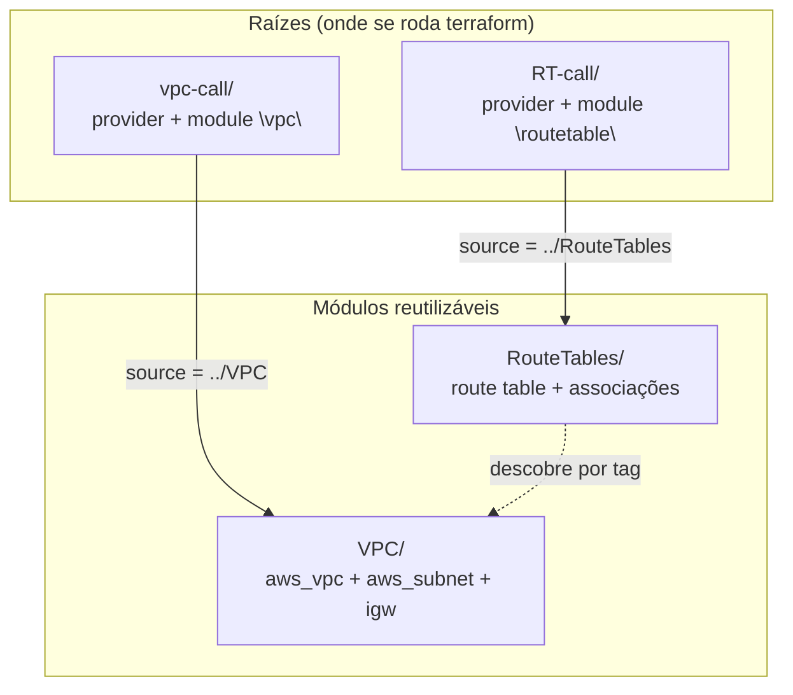

# 01.2 - Módulos: componentizando a rede da Vortex

> **Terça-feira, 14h. Mês 1 na Vortex Mobility.**
> A prova de conceito da EC2 convenceu Helena. Agora vem o pulo: a rede.
>
> > *— "A Vortex vai abrir em 30 cidades. Cada ambiente precisa de uma VPC com subnets em todas as zonas de disponibilidade e rotas para a internet. Não quero copiar e colar esse bloco de rede 30 vezes — quero **um módulo** que eu chame quantas vezes precisar."*
>
> Diego complementa: *— "Módulo é como uma função: você escreve a rede uma vez, dá um `source`, e chama. Se mudar a regra de rede, muda num lugar só."*

Os comandos `bash` deste lab rodam **no terminal do Codespaces**. As verificações são feitas **no console da AWS** (painel VPC).

> [!WARNING]
> **Pré-requisitos obrigatórios antes de começar:**
>
> - [ ] [Lab 01.1 — Plan e Apply](../01-Plan-Apply/README.md) concluído (você entende o ciclo `init`/`plan`/`apply`/`destroy`)
> - [ ] Credenciais AWS do Academy atualizadas no Codespaces
> - [ ] Terraform instalado (`terraform -version` → 1.x)
> - [ ] Você consegue abrir o [painel VPC](https://us-east-1.console.aws.amazon.com/vpc/home?region=us-east-1#vpcs:)
>
> **Valide rapidamente:**
>
> ```bash
> aws sts get-caller-identity
> ```
>
> **O que você vai fazer:** subir uma VPC com subnets públicas em todas as AZs (via um módulo), depois subir as route tables (via outro módulo), e ver os dois módulos colaborando. **Tempo estimado: ~25 min.**

> [!IMPORTANT]
> A rede que você criar aqui **não será destruída ao final** — a próxima demo (01.3 — Count) escala uma frota de servidores **dentro desta VPC**. Só destruiremos a rede ao final da demo Count.

## Principais pontos de aprendizagem

- o que é um módulo e por que pastas com sufixo `-call` o invocam
- referenciar um módulo local com `source`
- criar recursos dinamicamente em todas as AZs com `count` + `data source`
- separar a criação de recursos (módulo) da invocação (raiz)

## O que você terá ao final

A base de rede da Vortex — uma VPC com subnets públicas e rotas para a internet — definida como **módulos reutilizáveis**, exatamente o que Helena pediu para não copiar e colar a cada nova cidade.

> [!TIP]
> Sempre que encontrar um bloco **💡 Clique para entender**, abra-o. Ele aprofunda sem atrapalhar quem só quer seguir o passo a passo.

## Mapa do lab

| Parte | O que você faz | Passos | Tempo |
|-------|----------------|--------|-------|
| [Parte 1](#parte-1---subindo-a-vpc-via-módulo) | Subindo a VPC via módulo | [1](#passo-1) · [2](#passo-2) · [3](#passo-3) · [4](#passo-4) · [5](#passo-5) | ~12 min |
| [Parte 2](#parte-2---subindo-as-route-tables-via-módulo) | Subindo as route tables via módulo | [6](#passo-6) · [7](#passo-7) · [8](#passo-8) · [9](#passo-9) · [10](#passo-10) | ~13 min |

> [!TIP]
> Se travou em algum passo, clique no número dele na coluna **Passos**.

## Contexto

A estrutura de pastas conta a história: as pastas `VPC` e `RouteTables` **definem** módulos (os blocos reutilizáveis); as pastas `vpc-call` e `RT-call` **invocam** esses módulos. A raiz (onde você roda `terraform init`) é sempre a `-call` — ela carrega o provider e chama o módulo.



<details>
<summary><b>💡 Clique para entender: o que é um módulo no Terraform</b></summary>
<blockquote>

Um **módulo** é um conjunto de arquivos `.tf` agrupados que encapsulam recursos relacionados, permitindo reúso e organização. Pense numa função: você escreve a lógica uma vez e chama com argumentos diferentes.

- As pastas com sufixo **`-call`** são os **pontos de entrada**: invocam módulos e passam parâmetros. É nelas que mora o `provider` e onde se roda `terraform init`/`apply`.
- As pastas de **módulo** (`VPC`, `RouteTables`) contêm a definição dos recursos e **não** declaram o provider — quem fornece o provider é a raiz que as chama.

Exemplo de invocação:

```hcl
module "vpc" {
  source = "../VPC"
}
```

Documentação oficial: [Módulos no Terraform](https://developer.hashicorp.com/terraform/language/modules)

</blockquote>
</details>

---

## Parte 1 - Subindo a VPC via módulo

### Resultado esperado desta parte

Uma VPC com uma subnet pública por zona de disponibilidade e um Internet Gateway, todos criados por um módulo invocado a partir de `vpc-call`.

---

<a id="passo-1"></a>

**1.** Entre na pasta que invoca o módulo de VPC:

```bash
cd /workspaces/FIAP-Platform-Engineering/01-Terraform/demos/02-Modules/vpc-call
```

---

<a id="passo-2"></a>

**2.** Inicialize (note que o `init` também baixa o módulo local `../VPC`):

```bash
terraform init
```

---

<a id="passo-3"></a>

**3.** Gere o plano:

```bash
terraform plan
```

---

<a id="passo-4"></a>

**4.** Aplique:

```bash
terraform apply -auto-approve
```

<details>
<summary><b>💡 Clique para entender: o código do módulo VPC</b></summary>
<blockquote>

**`vpc-call/main.tf`** (a raiz) apenas chama o módulo:

```hcl
module "vpc" {
  source = "../VPC"
}
```

O provider fica em `vpc-call/provider.tf` e as versões em `vpc-call/versions.tf` — o módulo filho **não** repete isso.

Dentro do módulo `VPC/`:

**`vars.tf`** define variáveis e descobre as AZs da região:

```hcl
data "aws_availability_zones" "available" {}

variable "project"       { default = "fiap-lab" }
variable "vpc_cidr"      { default = "9.0.0.0/16" }
variable "subnet_escale" { default = 6 }
variable "env"           { default = "prod" }
```

**`vpc.tf`** cria a VPC e **uma subnet por AZ** usando `count`:

```hcl
resource "aws_vpc" "vpc_created" {
  cidr_block           = var.vpc_cidr
  enable_dns_support   = true
  enable_dns_hostnames = true
  tags = { Name = var.project, env = var.env }
}

resource "aws_subnet" "public_igw" {
  count                   = length(data.aws_availability_zones.available.names)
  vpc_id                  = aws_vpc.vpc_created.id
  cidr_block              = cidrsubnet(var.vpc_cidr, var.subnet_escale, count.index + 1)
  map_public_ip_on_launch = true
  availability_zone       = data.aws_availability_zones.available.names[count.index]
  tags = {
    Name = "${var.project}_public_igw_${data.aws_availability_zones.available.names[count.index]}"
    Tier = "Public"
    env  = var.env
  }
}
```

- `count = length(...)` cria tantas subnets quantas AZs existirem na região
- `cidrsubnet(...)` fatia o CIDR da VPC em blocos menores, um por subnet
- a tag `Tier = "Public"` é o que a Parte 2 vai usar para **descobrir** essas subnets

**`igw.tf`** conecta a VPC à internet:

```hcl
resource "aws_internet_gateway" "igw" {
  vpc_id = aws_vpc.vpc_created.id
  tags   = { Name = "igw-${var.project}", env = var.env }
}
```

Documentação oficial: [aws_vpc](https://registry.terraform.io/providers/hashicorp/aws/latest/docs/resources/vpc) · [count](https://developer.hashicorp.com/terraform/language/meta-arguments/count)

</blockquote>
</details>

---

<a id="passo-5"></a>

**5.** No console, confirme que a VPC e as subnets foram criadas: [VPCs](https://us-east-1.console.aws.amazon.com/vpc/home?region=us-east-1#vpcs:) e [Subnets](https://us-east-1.console.aws.amazon.com/vpc/home?region=us-east-1#subnets:).


### Checkpoint

Se chegou até aqui:

- a VPC `fiap-lab` existe
- há uma subnet pública por AZ (tag `Tier=Public`)
- o Internet Gateway está associado à VPC

---

## Parte 2 - Subindo as route tables via módulo

### Resultado esperado desta parte

Uma route table apontando para o Internet Gateway, associada a todas as subnets públicas — criada por um segundo módulo que **descobre** a VPC e o IGW criados na Parte 1.

---

<a id="passo-6"></a>

**6.** Volte para a pasta de módulos e entre na que invoca as route tables:

```bash
cd /workspaces/FIAP-Platform-Engineering/01-Terraform/demos/02-Modules/RT-call
```

> [!NOTE]
> A pasta se chama exatamente `RT-call` (com `RT` maiúsculo). O `cd` acima já usa o nome correto.

---

<a id="passo-7"></a>

**7.** Inicialize:

```bash
terraform init
```

---

<a id="passo-8"></a>

**8.** Gere o plano:

```bash
terraform plan
```

---

<a id="passo-9"></a>

**9.** Aplique:

```bash
terraform apply -auto-approve
```

<details>
<summary><b>💡 Clique para entender: o código do módulo RouteTables</b></summary>
<blockquote>

**`RT-call/main.tf`** chama o módulo:

```hcl
module "routetable" {
  source = "../RouteTables"
}
```

Dentro de `RouteTables/`:

**`vars.tf`** **descobre** a VPC e o IGW que a Parte 1 criou, usando data sources por tag/filtro (não recria nada):

```hcl
data "aws_vpc" "vpc" {
  tags = { Name = var.project }
}

data "aws_internet_gateway" "igw" {
  filter {
    name   = "attachment.vpc-id"
    values = [data.aws_vpc.vpc.id]
  }
}
```

**`routetable.tf`** cria a rota padrão para a internet:

```hcl
resource "aws_route_table" "to-igw" {
  vpc_id = data.aws_vpc.vpc.id
  route {
    cidr_block = "0.0.0.0/0"
    gateway_id = data.aws_internet_gateway.igw.id
  }
  tags = { Name = "to-igw-${var.project}", env = var.env }
}
```

**`public.tf`** descobre as subnets públicas (pela tag `Tier=Public`) e associa cada uma à route table:

```hcl
data "aws_subnets" "all" {
  filter { name = "tag:Tier", values = ["Public"] }
  filter { name = "vpc-id",   values = [data.aws_vpc.vpc.id] }
}

data "aws_subnet" "public" {
  for_each = toset(data.aws_subnets.all.ids)
  id       = each.value
}

resource "aws_route_table_association" "public_association" {
  for_each       = data.aws_subnet.public
  subnet_id      = each.value.id
  route_table_id = aws_route_table.to-igw.id
}
```

Esse é o padrão profissional: **um módulo entrega a rede, outro entrega o roteamento**, e o segundo descobre o primeiro por tags — sem acoplamento rígido.

Documentação oficial: [aws_route_table](https://registry.terraform.io/providers/hashicorp/aws/latest/docs/resources/route_table) · [for_each](https://developer.hashicorp.com/terraform/language/meta-arguments/for_each)

</blockquote>
</details>

---

<a id="passo-10"></a>

**10.** Analise o resultado no [painel VPC → Route Tables](https://us-east-1.console.aws.amazon.com/vpc/home?region=us-east-1#RouteTables:). Você verá a route table `to-igw-fiap-lab` com a rota `0.0.0.0/0` para o IGW, associada às subnets públicas. Olhe o código, compare com o console e faça perguntas: foi criada uma VPC com uma subnet pública por AZ e as rotas para o Internet Gateway, tudo via módulos.

### Checkpoint

Se chegou até aqui:

- existe uma route table apontando para o IGW
- todas as subnets públicas estão associadas a ela
- a rede da Vortex está pronta para receber servidores (próxima demo)

---

## Conclusão

Você componentizou a rede da Vortex em dois módulos reutilizáveis: um para a VPC/subnets/IGW, outro para o roteamento. A raiz (`-call`) só invoca; o módulo define. Mudou a regra de rede? Muda no módulo, uma vez.

**Mensagem para Helena:** a rede agora é um módulo. Para abrir a 31ª cidade, é um `module "vpc"` a mais — não copiar e colar 40 linhas de HCL. O próximo passo é colocar servidores nessa rede e escalá-los só mudando um número.

## Próximo passo

Abra o próximo lab: **[Lab 01.3 — Count](../03-Count/README.md)**.

Lá vamos subir uma frota de servidores web **dentro desta VPC**, atrás de um load balancer, e escalá-la de 2 para 3 e de volta para 1 só mudando o `count` — sem reescrever nada.

> [!CAUTION]
> **Não destrua a rede agora.** A demo Count usa esta VPC. O `destroy` da rede acontece ao final do Lab 01.3.

---

<details>
<summary><b>💡 Glossário rápido — termos que aparecem neste lab</b></summary>
<blockquote>

| Termo | O que é |
|-------|---------|
| **Módulo** | Conjunto de `.tf` reutilizável, invocado com `module "x" { source = ... }`. |
| **VPC** | Virtual Private Cloud — rede virtual isolada na AWS. |
| **Subnet** | Faixa de IPs dentro da VPC, atrelada a uma zona de disponibilidade. |
| **AZ (Availability Zone)** | Data center isolado dentro de uma região AWS. |
| **Internet Gateway (IGW)** | Componente que conecta a VPC à internet. |
| **Route Table** | Tabela de rotas que diz para onde o tráfego de uma subnet vai. |
| **Data source** | Bloco `data` que lê recursos existentes (aqui, descobre a VPC por tag). |
| **`count` / `for_each`** | Meta-argumentos que criam vários recursos a partir de uma definição. |
| **`cidrsubnet()`** | Função que fatia um bloco CIDR em sub-blocos menores. |

</blockquote>
</details>

<details>
<summary><b>💡 Como pedir ajuda se travou</b></summary>
<blockquote>

Antes de pedir ajuda, colete estas 4 informações:

1. **Em que passo você está** (ex.: "passo 9, `apply` do RT-call")
2. **Mensagem de erro literal** (texto do terminal, não screenshot)
3. **Saída de** `terraform output` (na pasta `vpc-call`) e `aws sts get-caller-identity`
4. **O que você já tentou**

Canais (em ordem de prioridade):

- **Issues do repositório**: [github.com/vamperst/FIAP-Platform-Engineering/issues](https://github.com/vamperst/FIAP-Platform-Engineering/issues)
- **E-mail do professor**: `Rafael@rfbarbosa.com`
- **Antes de tudo**: se o `RT-call` reclamar que não acha a VPC, confirme que a Parte 1 (`vpc-call`) rodou com sucesso — o módulo de route table **descobre** a VPC por tag e precisa que ela exista.

</blockquote>
</details>
