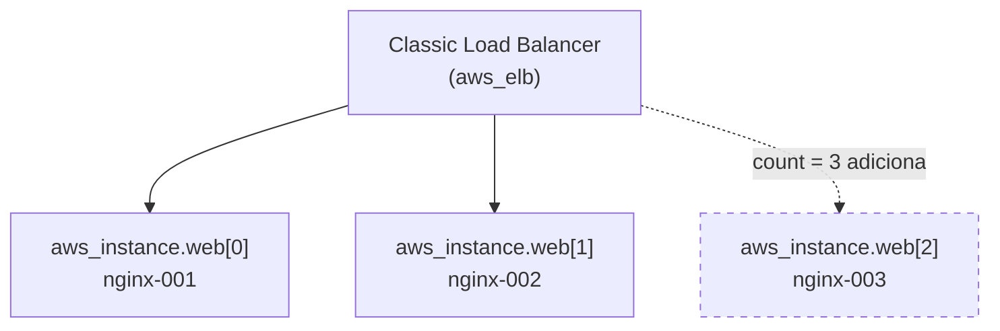

# 01.3 - Count: escalando a frota de servidores da Vortex

> **Quinta-feira, 11h. Mês 1 na Vortex Mobility.**
> O lançamento na nova cidade dobrou o tráfego no app da Vortex. Helena chega com a pressão da operação:
>
> > *— "Um servidor web não aguenta o pico do horário de almoço. Preciso de uma **frota** atrás de um load balancer, e preciso conseguir **escalar** rápido: de 2 para 5 servidores numa tarde de promoção, e de volta para 2 à noite. Não quero reescrever a infra cada vez — quero mudar **um número**."*
>
> Diego sorri: *— "É exatamente para isso que existe o `count`. Você descreve **um** servidor e diz quantos quer. O Terraform cuida do resto, inclusive de registrar no balanceador."*

Os comandos `bash` rodam **no terminal do Codespaces**. As verificações são feitas **no console da AWS** (painel EC2 / Load Balancer).

> [!WARNING]
> **Pré-requisitos obrigatórios antes de começar:**
>
> - [ ] [Lab 01.2 — Módulos](../02-Modules/README.md) concluído **por completo** — tanto o `vpc-call` (VPC + subnets) **quanto o `RT-call` (route tables com rota para o Internet Gateway)**. Sem as rotas, os servidores sobem mas ficam sem internet e a instalação via SSH falha por timeout.
> - [ ] Credenciais AWS do Academy atualizadas no Codespaces
> - [ ] Par de chaves `vockey` em `/home/vscode/.ssh/vockey.pem`
> - [ ] Você consegue abrir o [painel EC2 → Load Balancers](https://us-east-1.console.aws.amazon.com/ec2/home?region=us-east-1#LoadBalancers:)
>
> **Valide rapidamente que a rede do lab anterior existe e tem rota para a internet:**
>
> ```bash
> VPC_ID=$(aws ec2 describe-vpcs --filters "Name=tag:Name,Values=fiap-lab" --query "Vpcs[0].VpcId" --output text)
> echo "VPC: $VPC_ID"
> aws ec2 describe-route-tables --filters "Name=vpc-id,Values=$VPC_ID" \
>   --query "RouteTables[].Routes[?GatewayId!='local'].GatewayId" --output text
> ```
>
> Se a primeira linha imprimir um `vpc-...` **e** a segunda imprimir um `igw-...`, a rede está completa e você pode seguir. Se a VPC vier vazia, suba o `vpc-call`; se a VPC existir mas não houver `igw-...`, falta rodar o `RT-call` — volte ao [Lab 01.2](../02-Modules/README.md).
>
> **O que você vai fazer:** subir uma frota de 2 servidores web atrás de um Classic Load Balancer, escalar para 3, reduzir para 1, e destruir tudo (frota + rede). **Tempo estimado: ~30 min.**

## Principais pontos de aprendizagem

- usar `count` para criar N cópias de um recurso a partir de uma única definição
- referenciar todas as cópias com a expressão splat (`aws_instance.web[*].id`)
- registrar a frota automaticamente em um Classic Load Balancer (`aws_elb`)
- escalar para cima e para baixo mudando apenas o `count`

## O que você terá ao final

Uma frota de servidores web da Vortex atrás de um load balancer, que escala de 2 para N **mudando um número** — exatamente o controle de capacidade que Helena pediu para os picos.

> [!TIP]
> Sempre que encontrar um bloco **💡 Clique para entender**, abra-o.

## Mapa do lab

| Parte | O que você faz | Passos | Tempo |
|-------|----------------|--------|-------|
| [Parte 1](#parte-1---subindo-a-frota-inicial) | Subindo a frota inicial (count = 2) | [1](#passo-1) · [2](#passo-2) · [3](#passo-3) · [4](#passo-4) · [5](#passo-5) · [6](#passo-6) | ~15 min |
| [Parte 2](#parte-2---escalando-a-frota) | Escalando a frota (2 → 3 → 1) e destruindo | [7](#passo-7) · [8](#passo-8) · [9](#passo-9) · [10](#passo-10) · [11](#passo-11) · [12](#passo-12) | ~15 min |

> [!TIP]
> Se travou em algum passo, clique no número dele na coluna **Passos**.

## Por que essa abordagem existe

| Aspecto | Resposta curta |
|---------|----------------|
| **Problema de negócio** | A Vortex precisa variar a capacidade de servidores conforme o tráfego, rápido e sem retrabalho. |
| **Pergunta que responde bem** | "Quero N servidores idênticos atrás de um balanceador." |
| **Pergunta que responde mal** | "Quero servidores **diferentes entre si**" — aí `count` é fraco e `for_each` ou módulos servem melhor. |
| **Quando acontece na vida real** | Escalar web servers, workers de fila, réplicas de processamento batch. |

## Contexto

`count` é o jeito mais direto de criar várias cópias de um recurso. Você descreve a EC2 uma vez e diz `count = 2`; o Terraform cria `aws_instance.web[0]` e `aws_instance.web[1]`. O Classic Load Balancer (`aws_elb`) recebe a lista de IDs de todas as instâncias via splat (`aws_instance.web[*].id`) e as registra automaticamente. Para escalar, você muda o número e roda `apply` de novo — o Terraform calcula o delta (criar/destruir a diferença).



---

## Parte 1 - Subindo a frota inicial

### Resultado esperado desta parte

Dois servidores Nginx registrados em um Classic Load Balancer, acessíveis pelo DNS do balanceador.

---

<a id="passo-1"></a>

**1.** Entre na pasta da demo:

```bash
cd /workspaces/FIAP-Platform-Engineering/01-Terraform/demos/03-Count
```

---

<a id="passo-2"></a>

**2.** Inicialize:

```bash
terraform init
```

---

<a id="passo-3"></a>

**3.** Aplique para criar a frota inicial:

```bash
terraform apply -auto-approve
```

<details>
<summary><b>💡 Clique para entender: o código real desta demo</b></summary>
<blockquote>

Esta demo usa um **Classic Load Balancer** (recurso `aws_elb`), não um Application Load Balancer. São coisas diferentes na AWS — o Classic ELB é mais simples (sem target group, sem listener com ARN), o que o torna didático para focar no `count`.

**`versions.tf`** declara os providers (`aws ~> 6.0` e `random ~> 3.0`).

**`variables.tf`** define a região e descobre a AMI dinamicamente (Amazon Linux 2023), além das variáveis da chave SSH:

```hcl
data "aws_ami" "amazon_linux" {
  most_recent = true
  owners      = ["amazon"]
  filter {
    name   = "name"
    values = ["al2023-ami-2023.*-x86_64"]
  }
  filter {
    name   = "virtualization-type"
    values = ["hvm"]
  }
}
```

**`main.tf`** descobre a rede do Lab 01.2, sorteia uma subnet, cria o ELB e a frota:

```hcl
# Descobre a VPC e as subnets publicas criadas no Lab 01.2 (por tag).
data "aws_vpc" "vpc" {
  tags = { Name = var.project }
}

data "aws_subnets" "all" {
  filter { name = "tag:Tier", values = ["Public"] }
  filter { name = "vpc-id",   values = [data.aws_vpc.vpc.id] }
}

data "aws_subnet" "public" {
  for_each = toset(data.aws_subnets.all.ids)
  id       = each.value
}

# Nem toda Availability Zone oferta todo tipo de instancia (ex.: us-east-1e nao
# tem t3.micro). Descobrimos as AZs que ofertam o tipo escolhido...
data "aws_ec2_instance_type_offerings" "supported" {
  filter {
    name   = "instance-type"
    values = [var.instance_type]
  }
  location_type = "availability-zone"
}

locals {
  supported_azs = toset(data.aws_ec2_instance_type_offerings.supported.locations)
  eligible_subnet_ids = [
    for s in data.aws_subnet.public : s.id
    if contains(local.supported_azs, s.availability_zone)
  ]
}

# ...e sorteamos apenas entre as subnets dessas AZs.
resource "random_shuffle" "random_subnet" {
  input        = local.eligible_subnet_ids
  result_count = 1
}

# Classic Load Balancer: distribui o trafego HTTP entre as instancias.
resource "aws_elb" "web" {
  name            = "terraform-example-elb"
  subnets         = data.aws_subnets.all.ids
  security_groups = [aws_security_group.allow-ssh.id]

  listener {
    instance_port     = 80
    instance_protocol = "http"
    lb_port           = 80
    lb_protocol       = "http"
  }

  health_check {
    healthy_threshold   = 2
    unhealthy_threshold = 2
    timeout             = 3
    target              = "HTTP:80/"
    interval            = 6
  }

  # As instancias da frota sao registradas automaticamente.
  instances = aws_instance.web[*].id
}

# A frota. count = 2 cria duas EC2 identicas; mudar esse numero escala a frota.
resource "aws_instance" "web" {
  instance_type = var.instance_type
  ami           = data.aws_ami.amazon_linux.id
  count         = 2

  subnet_id              = random_shuffle.random_subnet.result[0]
  vpc_security_group_ids = [aws_security_group.allow-ssh.id]
  key_name               = var.key_name

  provisioner "file" {
    source      = "script.sh"
    destination = "/tmp/script.sh"
  }
  provisioner "remote-exec" {
    inline = ["chmod +x /tmp/script.sh", "sudo /tmp/script.sh"]
  }
  connection {
    user        = var.instance_username
    private_key = file(var.path_to_key)
    host        = self.public_dns
  }

  tags = {
    Name = format("nginx-%03d", count.index + 1)
  }
}
```

Pontos-chave:

- `count = 2` cria `aws_instance.web[0]` e `aws_instance.web[1]`
- `aws_instance.web[*].id` é a expressão **splat**: a lista de IDs de **todas** as cópias, entregue ao ELB no atributo `instances`
- `format("nginx-%03d", count.index + 1)` nomeia as máquinas `nginx-001`, `nginx-002`, ...
- `random_shuffle` escolhe uma subnet pública para as instâncias — mas só entre as AZs que ofertam o `var.instance_type`, evitando o erro `Unsupported instance type` (a `us-east-1e`, por exemplo, não tem `t3.micro`)

**`securitygroup.tf`** cria o SG `allow-ssh` liberando 22 e 80. **`script.sh`** instala o Nginx via `dnf` (Amazon Linux 2023). **`outputs.tf`** expõe o DNS do ELB e os endereços das instâncias.

Documentação oficial: [aws_elb (Classic)](https://registry.terraform.io/providers/hashicorp/aws/latest/docs/resources/elb) · [count](https://developer.hashicorp.com/terraform/language/meta-arguments/count) · [splat expressions](https://developer.hashicorp.com/terraform/language/expressions/references#references-to-resource-attributes)

</blockquote>
</details>

---

<a id="passo-4"></a>

**4.** Aguarde alguns minutos para as máquinas ficarem prontas e o `apply` terminar. No [painel do Load Balancer](https://us-east-1.console.aws.amazon.com/ec2/home?region=us-east-1#LoadBalancers:) → aba **Instances/Targets**, você verá inicialmente as máquinas em estado **Fora de serviço (OutOfService)** enquanto o ELB faz as verificações de integridade.

<details>
<summary><b>💡 Clique para entender: por que a instância demora a entrar no ELB</b></summary>
<blockquote>

Ao registrar uma instância no Classic Load Balancer, ela não recebe tráfego imediatamente. O ELB faz **health checks** antes de considerá-la saudável:

- **Registro do alvo:** o ELB reconhece a nova instância e a inclui no pool.
- **Health checks:** o ELB tenta conectar na porta 80 e avaliar a resposta (no nosso `health_check`, `target = "HTTP:80/"`, `interval = 6s`, `healthy_threshold = 2`). Só após 2 respostas saudáveis seguidas a instância vira `InService`.
- **Propagação:** o nome DNS do ELB leva alguns instantes para refletir o novo alvo.

Por isso é normal ver `OutOfService` logo após o `apply` — o Nginx ainda está subindo e o ELB ainda não validou a máquina. Aguarde os health checks passarem.

Documentação oficial: [Health checks do Classic Load Balancer](https://docs.aws.amazon.com/elasticloadbalancing/latest/classic/elb-healthchecks.html)

</blockquote>
</details>


---

<a id="passo-5"></a>

**5.** Aguarde até que todas as máquinas estejam **Em serviço (InService)**.


---

<a id="passo-6"></a>

**6.** Copie o DNS do ELB (saída `elb_public` do Terraform no Codespaces) e cole no navegador para testar a stack.


### Checkpoint

Se chegou até aqui:

- duas instâncias `nginx-001` e `nginx-002` estão rodando
- ambas aparecem `InService` no ELB
- o DNS do ELB serve a página do Nginx

---

## Parte 2 - Escalando a frota

### Resultado esperado desta parte

Você terá escalado a frota de 2 para 3 e de volta para 1 mudando apenas o `count`, observando o Terraform calcular o delta, e destruído tudo no final.

---

<a id="passo-7"></a>

**7.** Abra o `main.tf` e altere o `count` da `aws_instance.web` para `3`:

```bash
code main.tf
```

No bloco `resource "aws_instance" "web"`, troque `count = 2` por `count = 3`.


---

<a id="passo-8"></a>

**8.** Veja o plano: deve haver **1 a adicionar** (a nova máquina) e **1 a alterar** (o ELB, que passa a referenciar a máquina nova):

```bash
terraform plan
```


---

<a id="passo-9"></a>

**9.** Aplique a mudança:

```bash
terraform apply -auto-approve
```


No [painel do Load Balancer](https://us-east-1.console.aws.amazon.com/ec2/home?region=us-east-1#LoadBalancers:), a terceira máquina foi criada e registrada.


---

<a id="passo-10"></a>

**10.** Volte ao `main.tf` e reduza o `count` para `1`:

```bash
code main.tf
```


---

<a id="passo-11"></a>

**11.** Aplique de novo. Desta vez serão **2 destruições** de máquina e **1 alteração** no ELB:

```bash
terraform apply -auto-approve
```


No [painel do Load Balancer](https://us-east-1.console.aws.amazon.com/ec2/home?region=us-east-1#LoadBalancers:) restará uma única máquina.


---

<a id="passo-12"></a>

**12.** Destrua **toda** a infra deste lab — a frota e também a rede criada no Lab 01.2. Primeiro a frota (estamos na pasta `03-Count`):

```bash
terraform destroy -auto-approve
```

Depois destrua as route tables e a VPC, na ordem inversa em que foram criadas:

```bash
cd /workspaces/FIAP-Platform-Engineering/01-Terraform/demos/02-Modules/RT-call && terraform destroy -auto-approve
```

```bash
cd /workspaces/FIAP-Platform-Engineering/01-Terraform/demos/02-Modules/vpc-call && terraform destroy -auto-approve
```

<details>
<summary><b>⚠ Se der erro: <code>DependencyViolation</code> ao destruir a VPC</b></summary>
<blockquote>

Causa: ainda há recurso preso na VPC (uma EC2 ou o ELB não terminou de morrer). Confirme que o `destroy` da pasta `03-Count` terminou de fato (sem instâncias `running` no painel EC2) e que o `destroy` do `RT-call` rodou antes do `vpc-call`. Depois rode o `destroy` da VPC de novo.

</blockquote>
</details>

### Checkpoint

Se chegou até aqui:

- você escalou a frota 2 → 3 → 1 só mudando o `count`
- destruiu a frota, as route tables e a VPC
- não há mais nada cobrando na conta

---

## Conclusão

Você escalou uma frota inteira mudando um único número. O `count` transforma capacidade em parâmetro, e o ELB acompanha automaticamente. Esse é o controle elástico que toda operação web precisa.

**Mensagem para Helena:** a frota da Vortex agora é elástica. Pico de almoço? `count = 6`. Madrugada? `count = 2`. Um número, um `apply`, e o load balancer se ajusta sozinho. O próximo problema é mais sutil: à medida que o time cresce, **onde fica o estado** dessa infra para todos trabalharem sem se atropelar?

## Próximo passo

Abra o próximo lab: **[Lab 01.4 — State remoto](../04-State/README.md)**.

Lá vamos mover o estado do Terraform para um bucket S3 compartilhado, para que o time inteiro da Vortex colabore na mesma infraestrutura sem corromper o estado.

> [!CAUTION]
> **Custo:** este lab roda até 3 EC2 `t3.micro` (~$0,01/h cada) + 1 Classic ELB (~$0,025/h). Confirme no painel EC2 que **nenhuma** instância ficou `running` e que o load balancer sumiu após o passo 12. Esquecer ligado por um dia consome alguns dólares do orçamento do Learner Lab.

---

### Exercício

Para fixar, faça o exercício prático: **[Exercício — Count com SQS](../../exercicios/count/README.md)**.

---

<details>
<summary><b>💡 Glossário rápido — termos que aparecem neste lab</b></summary>
<blockquote>

| Termo | O que é |
|-------|---------|
| **`count`** | Meta-argumento que cria N cópias indexadas de um recurso (`.web[0]`, `.web[1]`...). |
| **`count.index`** | Índice (0, 1, 2...) da cópia atual, usado para diferenciar nomes/tags. |
| **Splat (`[*]`)** | Expressão que coleta um atributo de todas as cópias numa lista (`aws_instance.web[*].id`). |
| **Classic Load Balancer (`aws_elb`)** | Balanceador de carga "clássico" da AWS, anterior ao ALB. Simples, sem target groups. |
| **Health check** | Verificação periódica que o balanceador faz para decidir se uma instância recebe tráfego. |
| **`random_shuffle`** | Recurso do provider `random` que embaralha uma lista; aqui sorteia uma subnet. |
| **InService / OutOfService** | Estados de uma instância no Classic ELB (saudável / reprovada no health check). |

</blockquote>
</details>

<details>
<summary><b>💡 Como pedir ajuda se travou</b></summary>
<blockquote>

Antes de pedir ajuda, colete estas 4 informações:

1. **Em que passo você está** (ex.: "passo 9, escalei para 3")
2. **Mensagem de erro literal** (texto do terminal)
3. **Saída de** `terraform output` e do filtro de VPC do checklist de pré-requisitos
4. **O que você já tentou**

Canais (em ordem de prioridade):

- **Issues do repositório**: [github.com/vamperst/FIAP-Platform-Engineering/issues](https://github.com/vamperst/FIAP-Platform-Engineering/issues)
- **E-mail do professor**: `Rafael@rfbarbosa.com`
- **Antes de tudo**: se o `apply` falhar reclamando que não acha a VPC ou subnets, a rede do Lab 01.2 não está de pé. Rode o filtro de VPC do checklist; se vier vazio, volte ao Lab 01.2.

</blockquote>
</details>
