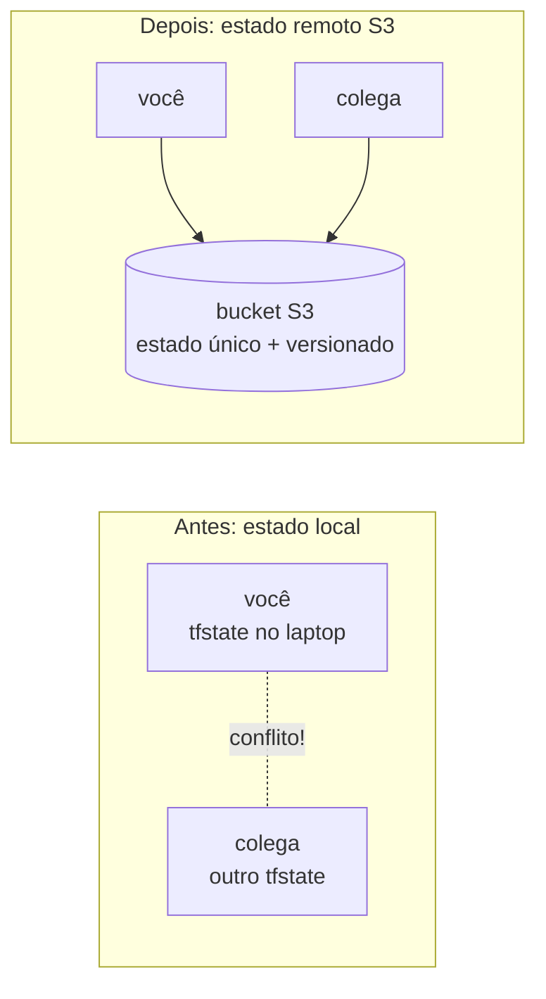

# 01.4 - State remoto: o time da Vortex colaborando sem corromper o estado

> **Sexta-feira, 9h. Mês 1 na Vortex Mobility.**
> A equipe de plataforma cresceu: agora são três pessoas mexendo na mesma infra. Na quinta passou perto do desastre — dois `apply` ao mesmo tempo quase recriaram a mesma VPC. Helena te chama:
>
> > *— "O estado do Terraform está no laptop de cada um. Isso não escala e é perigoso: se o seu Codespaces some, o estado some junto, e o time não enxerga o que você criou. Quero o estado **num lugar único e compartilhado**, com versionamento."*
>
> Diego confirma: *— "Estado remoto no S3. É o primeiro passo de qualquer time sério de Terraform. O bucket vira a fonte da verdade."*

Os comandos `bash` rodam **no terminal do Codespaces**. A verificação é feita **no console da AWS** (S3).

> [!WARNING]
> **Pré-requisitos obrigatórios antes de começar:**
>
> - [ ] [Lab 01.3 — Count](../03-Count/README.md) concluído (você domina o ciclo e já destruiu a frota)
> - [ ] A rede da demo 01.2 (VPC `fiap-lab`) aplicada — a instância de teste nasce numa subnet dela
> - [ ] Credenciais AWS do Academy atualizadas no Codespaces
> - [ ] Um bucket S3 criado no setup da disciplina (nome no formato `lab-fiap-<SUA-TURMA>-<SEU-RM>`)
>
> **Descubra o nome do seu bucket:**
>
> ```bash
> aws s3 ls
> ```
>
> **Confirme que a VPC da demo 01.2 está de pé:**
>
> ```bash
> aws ec2 describe-vpcs --filters "Name=tag:Name,Values=fiap-lab" --query "Vpcs[0].VpcId" --output text
> ```
>
> Se imprimir um `vpc-...`, a rede existe; se vier `None`, suba o [Lab 01.2](../02-Modules/README.md) antes.
>
> **O que você vai fazer:** configurar o backend S3 com locking nativo, ver o estado nascer no bucket, apagar a cópia local e provar que o `init` recupera o estado do S3, observar o **lock** bloqueando dois `apply` simultâneos, fazer **cirurgia de estado** (`state list/show/mv/rm`) e explorar **versionamento** e a questão dos **segredos em texto claro**. **Tempo estimado: ~50 min.**

## Principais pontos de aprendizagem

- o que é o arquivo de estado e por que ele é crítico
- configurar um backend remoto S3 (`terraform { backend "s3" {} }`) com locking nativo (`use_lockfile`)
- entender por que estado remoto habilita trabalho em equipe
- recuperar o estado do S3 após perder a cópia local
- ver o **lock** impedir dois `apply` concorrentes de corromper o estado
- inspecionar e reorganizar o estado com `terraform state list/show/mv/rm`
- restaurar uma versão anterior do estado (DR) e entender que segredos vivem em texto claro no tfstate

## O que você terá ao final

O estado da infra da Vortex centralizado num bucket S3 versionado — **a fonte única da verdade** que Helena pediu para o time inteiro trabalhar sem se atropelar.

> [!TIP]
> Sempre que encontrar um bloco **💡 Clique para entender**, abra-o.

## Mapa do lab

| Parte | O que você faz | Passos | Tempo |
|-------|----------------|--------|-------|
| [Parte 1](#parte-1---configurando-o-backend-s3) | Configurando o backend S3 | [1](#passo-1) · [2](#passo-2) · [3](#passo-3) · [4](#passo-4) · [5](#passo-5) · [6](#passo-6) · [7](#passo-7) | ~12 min |
| [Parte 2](#parte-2---provando-que-o-estado-vive-no-s3) | Provando que o estado vive no S3 | [8](#passo-8) · [9](#passo-9) · [10](#passo-10) | ~8 min |
| [Parte 3](#parte-3---lock-dois-apply-ao-mesmo-tempo) | Lock: dois `apply` ao mesmo tempo | [11](#passo-11) · [12](#passo-12) · [13](#passo-13) · [14](#passo-14) | ~10 min |
| [Parte 4](#parte-4---cirurgia-de-estado-state-list--show--mv--rm) | Cirurgia de estado (`state list/show/mv/rm`) | [15](#passo-15) · [16](#passo-16) · [17](#passo-17) · [18](#passo-18) · [19](#passo-19) | ~12 min |
| [Parte 5](#parte-5---versionamento-e-o-estado-em-texto-claro) | Versionamento e o estado em texto claro | [20](#passo-20) · [21](#passo-21) · [22](#passo-22) | ~8 min |

> [!TIP]
> Se travou em algum passo, clique no número dele na coluna **Passos**.

## Contexto

Por padrão, o Terraform guarda o estado num arquivo `terraform.tfstate` **local**. Isso funciona para uma pessoa, mas quebra em time: cada um teria sua cópia, e dois `apply` simultâneos corrompem tudo. O **backend remoto** move esse arquivo para um lugar central (aqui, um bucket S3). Com versionamento ativado no bucket, cada mudança gera uma versão — auditável e reversível.



---

## Parte 1 - Configurando o backend S3

### Resultado esperado desta parte

O Terraform passa a guardar o estado num objeto `demo-state/terraform.tfstate` dentro do seu bucket S3, com locking nativo ativado.

---

<a id="passo-1"></a>

**1.** Entre na pasta da demo:

```bash
cd /workspaces/FIAP-Platform-Engineering/01-Terraform/demos/04-State
```

---

<a id="passo-2"></a>

**2.** Descubra o nome do bucket criado no setup (vamos usá-lo como estado remoto):

```bash
aws s3 ls
```


---

<a id="passo-3"></a>

**3.** Entre na pasta `test`:

```bash
cd /workspaces/FIAP-Platform-Engineering/01-Terraform/demos/04-State/test
```

---

<a id="passo-4"></a>

**4.** Abra o `state.tf` e troque o valor de `bucket` pelo nome do seu bucket:

```bash
code state.tf
```


<details>
<summary><b>💡 Clique para entender: o bloco backend "s3"</b></summary>
<blockquote>

O arquivo `state.tf` configura onde o estado é guardado:

```hcl
terraform {
  backend "s3" {
    bucket       = "base-config-SEU-RM"
    key          = "demo-state/terraform.tfstate"
    region       = "us-east-1"
    use_lockfile = true
  }
}
```

- `backend "s3"` diz para guardar o estado num bucket S3, em vez de localmente.
- `bucket` é o nome do seu bucket (substitua pelo valor que apareceu em `aws s3 ls`). O nome de bucket S3 **não pode ter espaços nem maiúsculas** — `base-config-SEU-RM` é só um placeholder.
- `key` é o caminho/nome do objeto dentro do bucket onde o estado fica (`demo-state/terraform.tfstate`).
- `region` é a região do bucket.
- `use_lockfile = true` (Terraform 1.10+) liga o **locking de estado nativo no S3**: enquanto um `apply` roda, o Terraform cria um objeto `.tflock` ao lado do estado; um segundo `apply` concorrente é **bloqueado** até o primeiro liberar. Isso impede que dois `apply` simultâneos corrompam o estado — exatamente a dor da Vortex na cena de abertura. Antes do TF 1.10, esse lock exigia uma tabela DynamoDB separada; hoje o próprio S3 resolve.

Com versionamento ativado no bucket, cada `apply` gera uma nova versão do objeto — você pode reverter para um estado anterior se algo der errado (você vai ver isso na Parte 5).

> O nome do bucket **não pode ter espaços**. Use exatamente o nome que apareceu no `aws s3 ls`.

Documentação oficial: [Backend S3](https://developer.hashicorp.com/terraform/language/settings/backends/s3)

</blockquote>
</details>

<details>
<summary><b>⚠ Se der erro: <code>Error: Failed to get existing workspaces / NoSuchBucket</code></b></summary>
<blockquote>

Causa: o nome do bucket no `state.tf` está errado ou tem espaços. Confirme com `aws s3 ls`, cole o nome exato e rode `terraform init -reconfigure`.

</blockquote>
</details>

---

<a id="passo-5"></a>

**5.** Inicialize para sincronizar com o estado remoto:

```bash
terraform init
```

---

<a id="passo-6"></a>

**6.** Aplique para criar a instância de teste (o estado será gravado no S3):

```bash
terraform apply -auto-approve
```

---

<a id="passo-7"></a>

**7.** No [console do S3](https://s3.console.aws.amazon.com/s3/buckets?region=us-east-1), abra seu bucket e confirme que existe um objeto `demo-state/terraform.tfstate` — é o estado de tudo que o Terraform criou nesta pasta. Baixe e abra para ver o conteúdo.


<details>
<summary><b>💡 Clique para entender: o que é gravado no S3</b></summary>
<blockquote>

O objeto `demo-state/terraform.tfstate` no bucket contém o **estado do Terraform**: IDs dos recursos provisionados, suas configurações e as dependências entre eles. É como o Terraform sabe, no próximo `apply`, o que já existe e o que precisa mudar.

Boas práticas para o bucket de estado:

1. **Versionamento ativado** — para reverter a um estado anterior em caso de falha.
2. **Criptografia (SSE)** — o estado pode conter dados sensíveis.
3. **Controle de acesso** — só quem deve mexer na infra acessa o bucket.

> O estado **não** deve ser editado à mão. Trate-o como um banco de dados gerenciado pelo Terraform.

Documentação oficial: [State](https://developer.hashicorp.com/terraform/language/state)

</blockquote>
</details>

### Checkpoint

Se chegou até aqui:

- o `state.tf` aponta para o seu bucket
- o `apply` criou a instância de teste
- existe um objeto `teste` no bucket com o estado

---

## Parte 2 - Provando que o estado vive no S3

### Resultado esperado desta parte

Você apaga a cópia local do `.terraform`, roda `init` de novo e prova que o estado é recuperado do S3 — a infra continua intacta.

---

<a id="passo-8"></a>

**8.** Apague os arquivos locais do Terraform para simular um colega novo (ou seu Codespaces recriado):

```bash
rm -rf .terraform
```

---

<a id="passo-9"></a>

**9.** Rode `init` novamente. Além de baixar plugins, ele recupera o **último estado** do seu bucket S3:

```bash
terraform init
```

---

<a id="passo-10"></a>

**10.** Aplique de novo. Observe que **nada é criado ou alterado**: a instância já existe e o Terraform descobriu isso pelo estado remoto.

```bash
terraform apply -auto-approve
```


> [!NOTE]
> Esse "nada a fazer" é a prova do conceito: mesmo sem nenhum arquivo local de estado, o Terraform sabe exatamente o que existe — porque a verdade está no S3, não no seu laptop.

### Checkpoint

Se chegou até aqui:

- você apagou o estado local e o recuperou do S3
- provou que o `apply` não recria o que já existe
- a instância de teste continua de pé (vamos usá-la nas Partes 3 a 5)

---

## Parte 3 - Lock: dois `apply` ao mesmo tempo

> **Quinta-feira, 14h.** Helena passa na sua mesa: *— "Lembra do dia em que dois `apply` rodaram juntos e quase recriaram a VPC? Quero ver, com os meus olhos, esse acidente sendo **bloqueado** agora que ligamos o `use_lockfile`."* Vamos reproduzir a cena — de propósito.

### Resultado esperado desta parte

Você vê o lock nativo do S3 (o objeto `.tflock`) impedir que um segundo `terraform apply` rode enquanto o primeiro segura o estado — a proteção que torna o trabalho em equipe seguro.

---

<a id="passo-11"></a>

**11.** No terminal atual (terminal **A**), inicie um `apply` que vai segurar o lock. Quando o Terraform mostrar o plano e perguntar `Enter a value:`, **não responda ainda** — deixe parado:

```bash
terraform apply
```

> Enquanto este `apply` aguarda sua resposta, o lock está **adquirido**: existe um objeto `.tflock` no S3.

---

<a id="passo-12"></a>

**12.** Abra um **segundo terminal** (terminal **B**) no Codespaces e entre na mesma pasta:

```bash
cd /workspaces/FIAP-Platform-Engineering/01-Terraform/demos/04-State/test
```

---

<a id="passo-13"></a>

**13.** No terminal **B**, tente aplicar. O Terraform vai **falhar ao adquirir o lock** porque o terminal A o segura:

```bash
terraform apply -lock-timeout=0s
```

Saída real (resumida):

```text
╷
│ Error: Error acquiring the state lock
│
│ Error message: operation error S3: PutObject, https response error
│ Lock Info:
│   ID:        <uuid>
│   Path:      base-config-SEU-RM/demo-state/terraform.tfstate
│   Operation: OperationTypeApply
│   Who:       <usuario>@<host>
│   Created:   ...
│
│ Terraform acquires a state lock to protect the state from being written
│ again. For most commands, you can disable locking with the "-lock=false"
│ flag, but this is not recommended.
╵
```

> [!IMPORTANT]
> Esse erro **não é um defeito — é a proteção funcionando**. Sem o lock, os dois `apply` escreveriam o estado ao mesmo tempo e o corromperiam (a dor da cena de abertura). O `-lock-timeout=0s` faz o terminal B desistir na hora, em vez de ficar tentando por minutos.

<details>
<summary><b>💡 Clique para entender: o lock nativo do S3 e por que o DynamoDB não é mais necessário</b></summary>
<blockquote>

Com `use_lockfile = true` (Terraform 1.10+), antes de escrever o estado o Terraform faz um `PutObject` **condicional** de um objeto `<key>.tflock` (aqui, `demo-state/terraform.tfstate.tflock`). O S3 garante que esse `PutObject` só tem sucesso se o objeto ainda não existir — então **apenas um** processo consegue o lock por vez. Ao terminar, o Terraform apaga o `.tflock`, liberando o próximo.

Antes do TF 1.10, esse controle exigia uma **tabela DynamoDB** separada (`dynamodb_table`) só para guardar o lock. Era mais uma peça de infra para criar, pagar e manter. O `use_lockfile` resolve tudo dentro do próprio bucket — menos recursos, mesma garantia.

Você pode **ver** o `.tflock` no S3 enquanto o terminal A segura o lock:

```bash
aws s3 ls s3://base-config-SEU-RM/demo-state/
```

Vai listar `terraform.tfstate` **e** `terraform.tfstate.tflock`. Assim que você liberar o terminal A (próximo passo), o `.tflock` some.

Documentação oficial: [S3 backend — state locking](https://developer.hashicorp.com/terraform/language/backend/s3#state-locking)

</blockquote>
</details>

<details>
<summary><b>⚠ Se der erro: o terminal B <b>não</b> reclamou de lock e aplicou normalmente</b></summary>
<blockquote>

Provavelmente o terminal A já tinha terminado (você respondeu o prompt ou ele expirou) e liberou o lock antes de você rodar o passo 13. Volte ao passo 11, deixe o terminal A **parado no `Enter a value:`** e rode o passo 13 enquanto ele aguarda. Se o `apply` do A for rápido demais para segurar, alternativa confiável: liste o `.tflock` no S3 (comando do bloco acima) durante a janela do `apply`.

</blockquote>
</details>

---

<a id="passo-14"></a>

**14.** Volte ao terminal **A** e responda o prompt com `yes` (ou `no` para cancelar). Em qualquer caso, o lock é **liberado** e o `.tflock` desaparece do bucket. Confirme — o comando abaixo **descobre sozinho** o nome do seu bucket (o que começa com `base-config`) e lista o conteúdo da pasta de estado:

```bash
BUCKET=$(aws s3 ls | awk '{print $3}' | grep '^base-config' | head -1)
echo "Bucket: $BUCKET"
aws s3 ls "s3://$BUCKET/demo-state/"
```

Agora só aparece `terraform.tfstate` — o `.tflock` sumiu.

### Checkpoint

Se chegou até aqui:

- você viu o segundo `apply` falhar com `Error acquiring the state lock`
- entendeu que o `.tflock` no S3 é o que serializa os `apply` do time
- o lock foi liberado e o bucket voltou a ter só o `terraform.tfstate`

---

## Parte 4 - Cirurgia de estado (`state list` / `show` / `mv` / `rm`)

> **Sexta-feira, 11h.** Diego: *— "O estado é só um **mapa** entre o teu código e os recursos reais na AWS. Às vezes a gente precisa reorganizar esse mapa — renomear um recurso, esquecer outro — **sem destruir nada**. Os comandos `terraform state` fazem essa cirurgia."*

### Resultado esperado desta parte

Você inspeciona o estado, renomeia um recurso **só no estado** (sem destruir/recriar na AWS) e confirma com `terraform plan` que código e estado voltaram a bater (`No changes`).

---

<a id="passo-15"></a>

**15.** Liste tudo que o estado conhece — recursos **e** data sources:

```bash
terraform state list
```

Saída esperada (a ordem pode variar):

```text
data.aws_ami.amazon_linux
data.aws_ec2_instance_type_offerings.supported
data.aws_subnet.public["subnet-..."]
data.aws_subnets.public
data.aws_vpc.vpc
aws_instance.example
```

> Os `data.*` são as descobertas (a VPC `fiap-lab`, as subnets, a oferta de `t3.micro`); o único recurso **gerenciado** é `aws_instance.example`.

---

<a id="passo-16"></a>

**16.** Veja os atributos da instância gravados no estado:

```bash
terraform state show aws_instance.example
```

Saída (resumida):

```text
# aws_instance.example:
resource "aws_instance" "example" {
    ami           = "ami-..."
    id            = "i-..."
    instance_type = "t3.micro"
    private_ip    = "10.0.x.x"
    subnet_id     = "subnet-..."
    tags          = {
        "Name" = "vortex-state-demo"
    }
    ...
}
```

---

<a id="passo-17"></a>

**17.** Renomeie o recurso **no estado** de `aws_instance.example` para `aws_instance.web`. Isso muda o endereço no mapa **sem tocar na instância real**:

```bash
terraform state mv aws_instance.example aws_instance.web
```

Saída real:

```text
Move "aws_instance.example" to "aws_instance.web"
Successfully moved 1 object(s).
```

> [!IMPORTANT]
> Nenhuma EC2 foi destruída ou criada — só o **rótulo no estado** mudou. Mas agora o estado conhece `aws_instance.web` enquanto o código ainda diz `aws_instance.example`. Eles estão **desalinhados** — se você rodasse `apply` agora, o Terraform tentaria destruir `web` (sumiu do código) e criar `example` (novo). Vamos desfazer no próximo passo.

---

<a id="passo-18"></a>

**18.** Volte o nome para `aws_instance.example`, de modo que estado e código voltem a bater, e confirme com `plan`:

```bash
terraform state mv aws_instance.web aws_instance.example
terraform plan
```

O `plan` deve terminar com:

```text
No changes. Your infrastructure matches the configuration.
```

> Esse `No changes` é a prova de que a cirurgia foi **neutra**: o recurso real nunca mudou, só o endereço no estado — e agora ele bate com o código.

---

<a id="passo-19"></a>

**19.** (Conceito — **não execute**.) Existe também o `terraform state rm`, que **remove um recurso do estado sem destruí-lo na AWS**:

```bash
# terraform state rm aws_instance.example   # NAO EXECUTE neste lab
```

> [!CAUTION]
> `state rm` faz o Terraform **"esquecer"** o recurso: a EC2 continua rodando na AWS, mas o Terraform deixa de gerenciá-la (e um `apply` futuro tentaria **recriar** outra). Use só quando quiser entregar um recurso para outro state/ferramenta, ou antes de re-importá-lo. Errar aqui gera recursos órfãos pagando sem ninguém gerenciar.

<details>
<summary><b>💡 Clique para entender: quando usar <code>state mv</code> vs <code>state rm</code> (e por que hoje preferimos o bloco <code>moved</code>)</b></summary>
<blockquote>

- **`state mv`** — renomear/realocar um recurso no estado durante um refactor (mudou o nome do recurso, moveu para dentro de um módulo). É **imperativo**: você roda na sua máquina, e o colega precisa rodar o mesmo comando, senão o estado dele diverge.
- **`moved` block** — a forma **declarativa** e moderna de fazer o mesmo refactor. Você escreve o rename no código (`moved { from = ...  to = ... }`) e o Terraform aplica para todo mundo no próximo `apply`, versionado no Git. Hoje **preferimos `moved`** ao `state mv` justamente porque fica no código. Você viu isso na [demo 01.2 — Parte 4 (Refatorando sem destruir)](../02-Modules/README.md#parte-4---refatorando-sem-destruir-moved).
- **`state rm`** — remover do estado **sem destruir** na AWS. Para "desadotar" um recurso (entregar a outra ferramenta) ou limpar o estado antes de um `import` corrigido.

Documentação oficial: [Manipulating state](https://developer.hashicorp.com/terraform/cli/state)

</blockquote>
</details>

### Checkpoint

Se chegou até aqui:

- você listou recursos e data sources com `state list`
- inspecionou atributos com `state show`
- renomeou no estado com `state mv` e voltou, com `plan` dando `No changes`
- entende `state rm` como conceito (sem executar)

---

## Parte 5 - Versionamento e o estado em texto claro

> **Segunda-feira, 8h.** Helena, café na mão: *— "Duas perguntas finais. Se alguém estragar o estado, eu consigo **voltar no tempo**? E é verdade que **senha** fica em texto puro nesse arquivo?"* As duas respostas estão no S3.

### Resultado esperado desta parte

Você lista as versões do tfstate no bucket (base de um DR de estado) e entende, na prática, que o estado guarda atributos em **texto claro** — e as três mitigações.

---

<a id="passo-20"></a>

**20.** O bucket tem **versionamento**: cada `apply` gravou uma versão nova do tfstate. Liste-as:

```bash
aws s3api list-object-versions \
  --bucket base-config-SEU-RM \
  --prefix demo-state/terraform.tfstate \
  --query "Versions[].{VersionId:VersionId,LastModified:LastModified,Latest:IsLatest}" \
  --output table
```

Você verá **várias linhas**, uma por versão, cada uma com seu `VersionId` (a com `Latest = True` é a atual).

<details>
<summary><b>💡 Clique para entender: versionamento como DR de estado</b></summary>
<blockquote>

Se um `apply` errado ou um `state rm` acidental corromper o estado, você pode **restaurar uma versão anterior** baixando-a por `VersionId`:

```bash
# conceitual — recupera o conteudo de uma versao especifica para um arquivo local
aws s3api get-object \
  --bucket base-config-SEU-RM \
  --key demo-state/terraform.tfstate \
  --version-id <VERSION_ID_ANTERIOR> \
  estado-recuperado.tfstate
```

A partir daí você inspeciona o arquivo recuperado e, se for o caso, o promove à versão atual. **Sem versionamento ligado no bucket, essa rede de segurança não existe** — por isso ele é boa prática obrigatória para buckets de estado.

</blockquote>
</details>

---

<a id="passo-21"></a>

**21.** Baixe o estado atual e abra-o. Repare que **todos os atributos estão em texto claro** — IDs, IPs privados, tudo legível:

```bash
aws s3 cp s3://base-config-SEU-RM/demo-state/terraform.tfstate - | head -60
```

> [!CAUTION]
> O tfstate é **JSON em texto puro**. Tudo que um recurso expõe fica aqui legível. Se esta EC2 tivesse uma **senha de banco** (ex.: um `aws_db_instance` ou um `random_password`), a senha apareceria **literalmente** no arquivo — mesmo que no código você tenha marcado o output como `sensitive`.

<details>
<summary><b>💡 Clique para entender: <code>sensitive</code> esconde no CLI, mas NÃO no state</b></summary>
<blockquote>

Marcar uma variável/output como `sensitive` faz o Terraform **mascarar** o valor na saída do `plan`/`apply` e nos logs (mostra `(sensitive value)`). Mas isso é só cosmético para o terminal — **o valor continua em texto claro dentro do tfstate**.

Exemplo clássico: um `random_password` com `output { sensitive = true }`. No CLI você vê `(sensitive value)`; mas se abrir o tfstate, encontra literalmente:

```json
"result": "S3nh4-em-cl4ro-aqui"
```

Por isso o estado precisa de **três mitigações**, em camadas:

1. **Criptografia (SSE) no bucket** — o estado é cifrado em repouso no S3.
2. **Controle de acesso restrito** — só quem deve mexer na infra tem permissão de ler/escrever o bucket.
3. **Marcar variáveis sensíveis como `sensitive`** — protege CLI e logs (mas, repita-se, **não** o state).

E a evolução: **`ephemeral`** (recursos/valores efêmeros, Terraform 1.10) permite que certos valores — como senhas — **nunca sejam persistidos no estado**. É o caminho moderno para segredos que de fato não devem tocar o tfstate.

Documentação oficial: [Sensitive data in state](https://developer.hashicorp.com/terraform/language/state/sensitive-data) · [Ephemeral resources](https://developer.hashicorp.com/terraform/language/resources/ephemeral)

</blockquote>
</details>

---

<a id="passo-22"></a>

**22.** Encerrada a exploração, **destrua a instância de teste** (o estado no S3 é atualizado automaticamente, sob lock):

```bash
terraform destroy -auto-approve
```

### Checkpoint

Se chegou até aqui:

- você listou as versões do tfstate no bucket e entende como restaurar uma anterior
- viu que o estado guarda atributos em texto claro e conhece as 3 mitigações (SSE, acesso restrito, `sensitive`) + `ephemeral`
- destruiu a instância de teste

---

## Conclusão

Você moveu o estado para um bucket S3 e provou que ele sobrevive à perda da cópia local. Mais do que isso: viu o **lock** bloquear dois `apply` simultâneos, fez **cirurgia de estado** (`state list/show/mv/rm`) sem destruir nada, listou as **versões** do tfstate (a base de um DR de estado) e entendeu que o estado guarda **segredos em texto claro** — e como mitigar isso. Esse é o alicerce do trabalho em equipe com Terraform: uma fonte única, versionada, travada e compartilhada da verdade.

**⏱️ Cronômetro de reprodutibilidade da Vortex:** *o time inteiro partir do mesmo ponto da infra, sem se atropelar* — antes: cada um com seu tfstate no laptop, sem garantia de consistência e sem rede de segurança. Agora: **estado único no S3, versionado e recuperável, com lock que serializa os `apply`** — qualquer pessoa do time faz `init` e reconstrói exatamente o mesmo ponto, e dois `apply` concorrentes não corrompem mais nada.

**Mensagem para Helena:** o estado da Vortex agora vive no S3, não no laptop de ninguém. Qualquer pessoa do time faz `init` e enxerga a infra real; o lock nativo impede os `apply` simultâneos de se atropelarem; o versionamento dá DR; e sabemos que segredos no state pedem SSE, acesso restrito e (no futuro) `ephemeral`. O próximo passo é separar **dev de prod** sem duplicar o código — usando workspaces sobre esse mesmo estado remoto.

## Próximo passo

Abra o próximo lab: **[Lab 01.5 — Workspaces](../05-Workspaces/README.md)**.

Lá vamos isolar ambientes `dev` e `prod` com o mesmo código, cada um com seu próprio estado dentro do bucket S3.

> [!CAUTION]
> **Custo:** a instância de teste é uma EC2 `t3.micro` (~$0,01/h). Você já rodou `destroy` no passo 22 — confirme no painel EC2 que não sobrou nada `running`. O objeto de estado no S3 (e qualquer `.tflock` residual) é desprezível em custo.

---

<details>
<summary><b>💡 Glossário rápido — termos que aparecem neste lab</b></summary>
<blockquote>

| Termo | O que é |
|-------|---------|
| **State / Estado** | Arquivo onde o Terraform registra os recursos que gerencia (IDs, atributos, dependências). |
| **Backend** | Onde o estado é armazenado. `local` por padrão; `s3` neste lab. |
| **Backend S3** | Backend que guarda o estado num bucket S3, habilitando compartilhamento em equipe. |
| **`key` (no backend)** | Caminho/nome do objeto de estado dentro do bucket (`demo-state/terraform.tfstate`). |
| **`use_lockfile` / `.tflock`** | Locking de estado nativo no S3 (TF 1.10+): cria um objeto `.tflock` enquanto um `apply` roda, bloqueando um segundo concorrente. Dispensa DynamoDB. |
| **`terraform state mv`** | Renomeia/realoca um recurso **no estado** sem destruir/recriar na AWS. Hoje preferimos o bloco `moved` (declarativo). |
| **`terraform state rm`** | Remove um recurso **do estado** sem destruí-lo na AWS — o Terraform "esquece" o recurso. |
| **Versionamento (S3) / restore** | O bucket mantém versões anteriores de cada objeto; permite restaurar um tfstate antigo por `VersionId` (DR de estado). |
| **`sensitive`** | Marca uma variável/output para ser mascarada no CLI e nos logs — mas o valor **continua em texto claro no state**. |
| **`ephemeral`** | Recurso/valor efêmero (TF 1.10) que **nunca é persistido no estado** — caminho moderno para segredos. |
| **`terraform init -reconfigure`** | Reinicializa o backend quando a configuração dele mudou (ex.: nome do bucket). |

</blockquote>
</details>

<details>
<summary><b>💡 Como pedir ajuda se travou</b></summary>
<blockquote>

Antes de pedir ajuda, colete estas 4 informações:

1. **Em que passo você está** (ex.: "passo 5, `init` do backend")
2. **Mensagem de erro literal** (texto do terminal)
3. **Saída de** `aws s3 ls` (mostra se o bucket existe e o nome exato)
4. **O que você já tentou**

Canais (em ordem de prioridade):

- **Issues do repositório**: [github.com/vamperst/FIAP-Platform-Engineering/issues](https://github.com/vamperst/FIAP-Platform-Engineering/issues)
- **E-mail do professor**: `Rafael@rfbarbosa.com`
- **Antes de tudo**: ~80% dos erros aqui são nome de bucket incorreto no `state.tf`. Confira com `aws s3 ls` e rode `terraform init -reconfigure`.

</blockquote>
</details>
