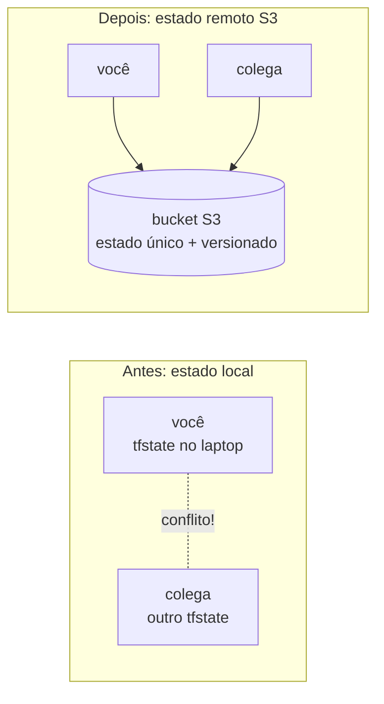

# 01.4 - State remoto: o time da Vortex colaborando sem corromper o estado

> **Sexta-feira, 9h. Mês 1 na Vortex Mobility.**
> A equipe de plataforma cresceu: agora são três pessoas mexendo na mesma infra. Na quinta passou perto do desastre — dois `apply` ao mesmo tempo quase recriaram a mesma VPC. Helena te chama:
>
> > *— "O estado do Terraform está no laptop de cada um. Isso não escala e é perigoso: se o seu Codespaces some, o estado some junto, e o time não enxerga o que você criou. Quero o estado **num lugar único e compartilhado**, com versionamento."*
>
> Diego confirma: *— "Estado remoto no S3. É o primeiro passo de qualquer time sério de Terraform. O bucket vira a fonte da verdade."*

Os comandos `bash` rodam **no terminal do Codespaces**. A verificação é feita **no console da AWS** (S3).

> [!WARNING]
> **Pré-requisitos obrigatórios antes de começar:**
>
> - [ ] [Lab 01.3 — Count](../03-Count/README.md) concluído (você domina o ciclo e já destruiu a frota)
> - [ ] Credenciais AWS do Academy atualizadas no Codespaces
> - [ ] Um bucket S3 criado no setup da disciplina (nome no formato `lab-fiap-<SUA-TURMA>-<SEU-RM>`)
>
> **Descubra o nome do seu bucket:**
>
> ```bash
> aws s3 ls
> ```
>
> **O que você vai fazer:** configurar o backend S3, ver o estado nascer no bucket, apagar a cópia local e provar que o `init` recupera o estado do S3. **Tempo estimado: ~20 min.**

## Principais pontos de aprendizagem

- o que é o arquivo de estado e por que ele é crítico
- configurar um backend remoto S3 (`terraform { backend "s3" {} }`)
- entender por que estado remoto habilita trabalho em equipe
- recuperar o estado do S3 após perder a cópia local

## O que você terá ao final

O estado da infra da Vortex centralizado num bucket S3 versionado — **a fonte única da verdade** que Helena pediu para o time inteiro trabalhar sem se atropelar.

> [!TIP]
> Sempre que encontrar um bloco **💡 Clique para entender**, abra-o.

## Mapa do lab

| Parte | O que você faz | Passos | Tempo |
|-------|----------------|--------|-------|
| [Parte 1](#parte-1---configurando-o-backend-s3) | Configurando o backend S3 | [1](#passo-1) · [2](#passo-2) · [3](#passo-3) · [4](#passo-4) · [5](#passo-5) · [6](#passo-6) · [7](#passo-7) | ~12 min |
| [Parte 2](#parte-2---provando-que-o-estado-vive-no-s3) | Provando que o estado vive no S3 | [8](#passo-8) · [9](#passo-9) · [10](#passo-10) · [11](#passo-11) | ~8 min |

> [!TIP]
> Se travou em algum passo, clique no número dele na coluna **Passos**.

## Contexto

Por padrão, o Terraform guarda o estado num arquivo `terraform.tfstate` **local**. Isso funciona para uma pessoa, mas quebra em time: cada um teria sua cópia, e dois `apply` simultâneos corrompem tudo. O **backend remoto** move esse arquivo para um lugar central (aqui, um bucket S3). Com versionamento ativado no bucket, cada mudança gera uma versão — auditável e reversível.



---

## Parte 1 - Configurando o backend S3

### Resultado esperado desta parte

O Terraform passa a guardar o estado num objeto chamado `teste` dentro do seu bucket S3.

---

<a id="passo-1"></a>

**1.** Entre na pasta da demo:

```bash
cd /workspaces/FIAP-Platform-Engineering/01-Terraform/demos/04-State
```

---

<a id="passo-2"></a>

**2.** Descubra o nome do bucket criado no setup (vamos usá-lo como estado remoto):

```bash
aws s3 ls
```


---

<a id="passo-3"></a>

**3.** Entre na pasta `test`:

```bash
cd /workspaces/FIAP-Platform-Engineering/01-Terraform/demos/04-State/test
```

---

<a id="passo-4"></a>

**4.** Abra o `state.tf` e troque o valor de `bucket` pelo nome do seu bucket:

```bash
code state.tf
```


<details>
<summary><b>💡 Clique para entender: o bloco backend "s3"</b></summary>
<blockquote>

O arquivo `state.tf` configura onde o estado é guardado:

```hcl
terraform {
  backend "s3" {
    bucket = "lab-fiap-SUA-TURMA-SEU-RM"
    key    = "teste"
    region = "us-east-1"
  }
}
```

- `backend "s3"` diz para guardar o estado num bucket S3, em vez de localmente.
- `bucket` é o nome do seu bucket (substitua pelo valor que apareceu em `aws s3 ls`).
- `key` é o caminho/nome do objeto dentro do bucket onde o estado fica (`teste`).
- `region` é a região do bucket.

Com versionamento ativado no bucket, cada `apply` gera uma nova versão do objeto — você pode reverter para um estado anterior se algo der errado.

> O nome do bucket **não pode ter espaços**. Use exatamente o nome que apareceu no `aws s3 ls`.

Documentação oficial: [Backend S3](https://developer.hashicorp.com/terraform/language/settings/backends/s3)

</blockquote>
</details>

<details>
<summary><b>⚠ Se der erro: <code>Error: Failed to get existing workspaces / NoSuchBucket</code></b></summary>
<blockquote>

Causa: o nome do bucket no `state.tf` está errado ou tem espaços. Confirme com `aws s3 ls`, cole o nome exato e rode `terraform init -reconfigure`.

</blockquote>
</details>

---

<a id="passo-5"></a>

**5.** Inicialize para sincronizar com o estado remoto:

```bash
terraform init
```

---

<a id="passo-6"></a>

**6.** Aplique para criar a instância de teste (o estado será gravado no S3):

```bash
terraform apply -auto-approve
```

---

<a id="passo-7"></a>

**7.** No [console do S3](https://s3.console.aws.amazon.com/s3/buckets?region=us-east-1), abra seu bucket e confirme que existe um objeto chamado `teste` — é o estado de tudo que o Terraform criou nesta pasta. Baixe e abra para ver o conteúdo.


<details>
<summary><b>💡 Clique para entender: o que é gravado no S3</b></summary>
<blockquote>

O objeto `teste` no bucket contém o **estado do Terraform**: IDs dos recursos provisionados, suas configurações e as dependências entre eles. É como o Terraform sabe, no próximo `apply`, o que já existe e o que precisa mudar.

Boas práticas para o bucket de estado:

1. **Versionamento ativado** — para reverter a um estado anterior em caso de falha.
2. **Criptografia (SSE)** — o estado pode conter dados sensíveis.
3. **Controle de acesso** — só quem deve mexer na infra acessa o bucket.

> O estado **não** deve ser editado à mão. Trate-o como um banco de dados gerenciado pelo Terraform.

Documentação oficial: [State](https://developer.hashicorp.com/terraform/language/state)

</blockquote>
</details>

### Checkpoint

Se chegou até aqui:

- o `state.tf` aponta para o seu bucket
- o `apply` criou a instância de teste
- existe um objeto `teste` no bucket com o estado

---

## Parte 2 - Provando que o estado vive no S3

### Resultado esperado desta parte

Você apaga a cópia local do `.terraform`, roda `init` de novo e prova que o estado é recuperado do S3 — a infra continua intacta.

---

<a id="passo-8"></a>

**8.** Apague os arquivos locais do Terraform para simular um colega novo (ou seu Codespaces recriado):

```bash
rm -rf .terraform
```

---

<a id="passo-9"></a>

**9.** Rode `init` novamente. Além de baixar plugins, ele recupera o **último estado** do seu bucket S3:

```bash
terraform init
```

---

<a id="passo-10"></a>

**10.** Aplique de novo. Observe que **nada é criado ou alterado**: a instância já existe e o Terraform descobriu isso pelo estado remoto.

```bash
terraform apply -auto-approve
```


> [!NOTE]
> Esse "nada a fazer" é a prova do conceito: mesmo sem nenhum arquivo local de estado, o Terraform sabe exatamente o que existe — porque a verdade está no S3, não no seu laptop.

---

<a id="passo-11"></a>

**11.** Destrua a instância de teste:

```bash
terraform destroy -auto-approve
```

### Checkpoint

Se chegou até aqui:

- você apagou o estado local e o recuperou do S3
- provou que o `apply` não recria o que já existe
- destruiu a instância de teste

---

## Conclusão

Você moveu o estado para um bucket S3 e provou que ele sobrevive à perda da cópia local. Esse é o alicerce do trabalho em equipe com Terraform: uma fonte única, versionada e compartilhada da verdade.

**Mensagem para Helena:** o estado da Vortex agora vive no S3, não no laptop de ninguém. Qualquer pessoa do time faz `init` e enxerga a infra real. O risco dos `apply` simultâneos diminuiu. O próximo passo é separar **dev de prod** sem duplicar o código — usando workspaces sobre esse mesmo estado remoto.

## Próximo passo

Abra o próximo lab: **[Lab 01.5 — Workspaces](../05-Workspaces/README.md)**.

Lá vamos isolar ambientes `dev` e `prod` com o mesmo código, cada um com seu próprio estado dentro do bucket S3.

> [!CAUTION]
> **Custo:** a instância de teste é uma EC2 `t3.micro` (~$0,01/h). Você já rodou `destroy` no passo 11 — confirme no painel EC2 que não sobrou nada `running`. O objeto de estado no S3 é desprezível em custo.

---

<details>
<summary><b>💡 Glossário rápido — termos que aparecem neste lab</b></summary>
<blockquote>

| Termo | O que é |
|-------|---------|
| **State / Estado** | Arquivo onde o Terraform registra os recursos que gerencia (IDs, atributos, dependências). |
| **Backend** | Onde o estado é armazenado. `local` por padrão; `s3` neste lab. |
| **Backend S3** | Backend que guarda o estado num bucket S3, habilitando compartilhamento em equipe. |
| **`key` (no backend)** | Caminho/nome do objeto de estado dentro do bucket. |
| **Versionamento (S3)** | Recurso do bucket que mantém versões anteriores de cada objeto. |
| **`terraform init -reconfigure`** | Reinicializa o backend quando a configuração dele mudou (ex.: nome do bucket). |

</blockquote>
</details>

<details>
<summary><b>💡 Como pedir ajuda se travou</b></summary>
<blockquote>

Antes de pedir ajuda, colete estas 4 informações:

1. **Em que passo você está** (ex.: "passo 5, `init` do backend")
2. **Mensagem de erro literal** (texto do terminal)
3. **Saída de** `aws s3 ls` (mostra se o bucket existe e o nome exato)
4. **O que você já tentou**

Canais (em ordem de prioridade):

- **Issues do repositório**: [github.com/vamperst/FIAP-Platform-Engineering/issues](https://github.com/vamperst/FIAP-Platform-Engineering/issues)
- **E-mail do professor**: `Rafael@rfbarbosa.com`
- **Antes de tudo**: ~80% dos erros aqui são nome de bucket incorreto no `state.tf`. Confira com `aws s3 ls` e rode `terraform init -reconfigure`.

</blockquote>
</details>
