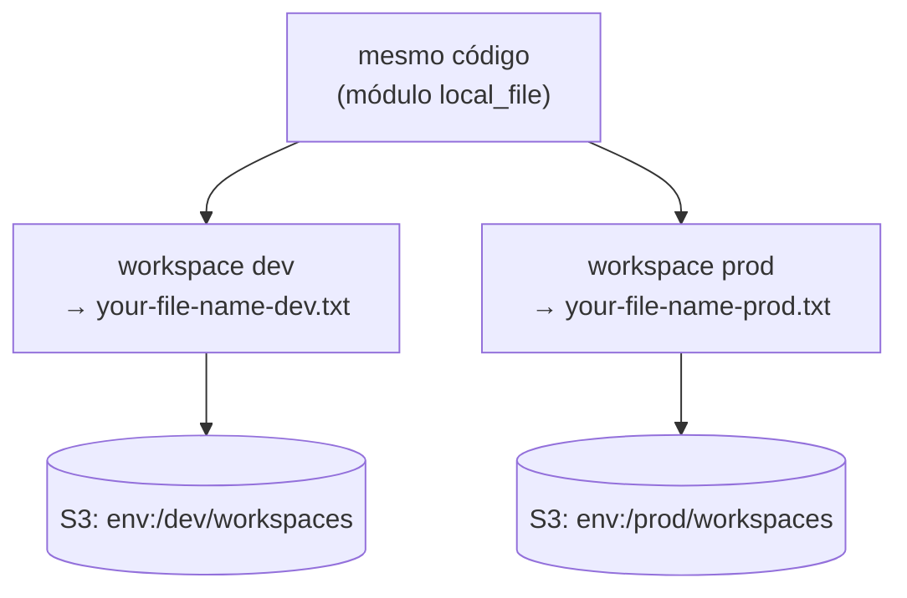

# 01.5 - Workspaces: isolando dev e prod da Vortex

> **Segunda-feira da semana seguinte, 10h. Fim do Mês 1 na Vortex Mobility.**
> Com o estado já no S3, falta o último pilar. Helena fecha o ciclo:
>
> > *— "Hoje a gente testa mudança de infra direto em produção, porque só temos um ambiente. Já derrubamos o app testando uma rede nova. Quero um **dev** e um **prod** separados, com o **mesmo código** — não quero manter duas cópias que vão divergir."*
>
> Diego arremata: *— "Workspaces. Mesmo código, estados separados por ambiente. Você troca de `dev` para `prod` com um comando, e o Terraform sabe que são duas infras distintas."*

Os comandos `bash` rodam **no terminal do Codespaces**. A verificação é feita **no console da AWS** (S3) e no terminal.

> [!WARNING]
> **Pré-requisitos obrigatórios antes de começar:**
>
> - [ ] [Lab 01.4 — State remoto](../04-State/README.md) concluído (você configurou um backend S3)
> - [ ] Credenciais AWS do Academy atualizadas no Codespaces
> - [ ] O nome do seu bucket S3 (`aws s3 ls`)
>
> **Descubra o nome do bucket:**
>
> ```bash
> aws s3 ls
> ```
>
> **O que você vai fazer:** configurar o backend, criar workspaces `dev` e `prod`, aplicar em cada um e ver que cada ambiente gera seu próprio arquivo e seu próprio estado no S3. **Tempo estimado: ~25 min.**

> [!NOTE]
> Para focar no conceito de workspace sem custo de infra, esta demo cria **arquivos locais** (`local_file`) em vez de recursos AWS. O ambiente atual (`dev`/`prod`) define o nome do arquivo gerado. O estado, esse sim, vai para o S3.

## Principais pontos de aprendizagem

- o que são workspaces e quando usá-los
- criar, listar, selecionar e deletar workspaces
- interpolar `terraform.workspace` na configuração para variar por ambiente
- entender que cada workspace tem seu próprio estado no backend

## O que você terá ao final

Os ambientes `dev` e `prod` da Vortex isolados sobre o **mesmo código**, cada um com seu estado no S3 — exatamente a separação que Helena pediu para parar de testar em produção.

> [!TIP]
> Sempre que encontrar um bloco **💡 Clique para entender**, abra-o.

## Mapa do lab

| Parte | O que você faz | Passos | Tempo |
|-------|----------------|--------|-------|
| [Parte 1](#parte-1---criando-os-workspaces) | Criando os workspaces | [1](#passo-1) · [2](#passo-2) · [3](#passo-3) · [4](#passo-4) · [5](#passo-5) · [6](#passo-6) · [7](#passo-7) | ~13 min |
| [Parte 2](#parte-2---aplicando-por-ambiente) | Aplicando por ambiente e observando o isolamento | [8](#passo-8) · [9](#passo-9) · [10](#passo-10) · [11](#passo-11) · [12](#passo-12) · [13](#passo-13) | ~12 min |

> [!TIP]
> Se travou em algum passo, clique no número dele na coluna **Passos**.

## Por que essa abordagem existe

| Aspecto | Resposta curta |
|---------|----------------|
| **Problema de negócio** | A Vortex precisa de dev e prod separados sem manter duas cópias do código. |
| **Pergunta que responde bem** | "Mesma infra, ambientes isolados, troca rápida entre eles." |
| **Pergunta que responde mal** | "Ambientes com **configurações radicalmente diferentes**" — aí repositórios/diretórios separados servem melhor. |
| **Quando acontece na vida real** | Pipelines de CI/CD que promovem a mesma stack de dev → homol → prod. |

## Contexto

Todo projeto Terraform começa no workspace `default`. Ao criar workspaces adicionais (`dev`, `prod`), você passa a ter **um estado por workspace**, todos sobre o mesmo código. A expressão `terraform.workspace` devolve o nome do ambiente atual, e você a usa para variar nomes/valores. No backend S3, cada workspace ganha seu próprio caminho de estado.



---

## Parte 1 - Criando os workspaces

### Resultado esperado desta parte

Os workspaces `dev` e `prod` criados, com o backend S3 inicializado.

---

<a id="passo-1"></a>

**1.** Entre na pasta da demo:

```bash
cd /workspaces/FIAP-Platform-Engineering/01-Terraform/demos/05-Workspaces
```

---

<a id="passo-2"></a>

**2.** Abra o `state.tf` e troque o `bucket` pelo nome do seu bucket S3 (descubra com `aws s3 ls` se não lembrar):

```bash
code state.tf
```

---

<a id="passo-3"></a>

**3.** Inicialize o Terraform:

```bash
terraform init
```

<details>
<summary><b>⚠ Se der erro: o nome do bucket está incorreto</b></summary>
<blockquote>

Se o `init` falhar reclamando do bucket, corrija o nome no `state.tf` e reconfigure o backend:

```bash
terraform init -reconfigure
```

</blockquote>
</details>

<details>
<summary><b>💡 Clique para entender: o módulo que cria arquivo por workspace</b></summary>
<blockquote>

O módulo em `modules/file/` cria um arquivo local cujo nome depende do workspace atual.

**`modules/file/main.tf`**:

```hcl
locals {
  env = terraform.workspace

  // Mapa de nomes de arquivo por workspace
  context = {
    default = { name = "${var.filename}-dev.txt" }
    dev     = { name = "${var.filename}-dev.txt" }
    homol   = { name = "${var.filename}-homol.txt" }
    prod    = { name = "${var.filename}-prod.txt" }
  }

  context_variables = local.context[local.env]
}

resource "local_file" "test" {
  content  = local.env
  filename = "${path.module}/${local.context_variables.name}"
}
```

- `terraform.workspace` devolve o nome do ambiente atual (`dev`, `prod`...).
- O mapa `context` traduz o workspace num sufixo de nome de arquivo.
- `local_file.test` grava um arquivo dentro de `modules/file/` com o nome correspondente — `your-file-name-dev.txt`, `your-file-name-prod.txt`, etc.

A raiz (`main.tf`) só invoca o módulo passando `filename = "your-file-name"`. Cada workspace, ao rodar `apply`, gera um arquivo diferente — provando o isolamento.

Documentação oficial: [Workspaces](https://developer.hashicorp.com/terraform/language/state/workspaces) · [local_file](https://registry.terraform.io/providers/hashicorp/local/latest/docs/resources/file)

</blockquote>
</details>

---

<a id="passo-4"></a>

**4.** Crie o workspace `dev`:

```bash
terraform workspace new dev
```

---

<a id="passo-5"></a>

**5.** Crie o workspace `prod`:

```bash
terraform workspace new prod
```

---

<a id="passo-6"></a>

**6.** Volte para o ambiente `dev`:

```bash
terraform workspace select dev
```

<details>
<summary><b>💡 Clique para entender: comandos de workspace</b></summary>
<blockquote>

Os principais comandos:

```bash
terraform workspace new <nome>      # cria e já entra no novo workspace
terraform workspace list            # lista todos (o * marca o atual)
terraform workspace select <nome>   # troca para outro workspace
terraform workspace delete <nome>   # remove (não pode ser o atual)
```

Cada workspace mantém um estado separado no backend. No S3, o Terraform cria o caminho `env:/<workspace>/<key>` para cada um — por isso `dev` e `prod` não se misturam.

> Para projetos pequenos/médios, workspaces são ótimos. Para ambientes com configurações muito distintas, prefira diretórios ou repositórios separados.

</blockquote>
</details>

---

<a id="passo-7"></a>

**7.** Liste os workspaces. Note o `default` (criado automaticamente pelo Terraform) além de `dev` e `prod`:

```bash
terraform workspace list
```


### Checkpoint

Se chegou até aqui:

- o backend S3 está inicializado
- os workspaces `dev` e `prod` existem
- você está posicionado no workspace `dev`

---

## Parte 2 - Aplicando por ambiente

### Resultado esperado desta parte

Cada workspace gera seu próprio arquivo em `modules/file/` e seu próprio estado no S3, provando o isolamento.

---

<a id="passo-8"></a>

**8.** Rode o `apply` em **cada** ambiente. Para `dev` (workspace atual):

```bash
terraform apply -auto-approve
```

Depois troque para `prod` e aplique também:

```bash
terraform workspace select prod && terraform apply -auto-approve
```

Cada `apply` gera um arquivo diferente dentro de `modules/file/` (um para `dev`, outro para `prod`).

---

<a id="passo-9"></a>

**9.** No [console do S3](https://s3.console.aws.amazon.com/s3/buckets?region=us-east-1), abra seu bucket. Verá uma estrutura de pastas `env:/dev/` e `env:/prod/`, cada uma com um objeto `workspaces` — o estado isolado de cada ambiente.

---

<a id="passo-10"></a>

**10.** De volta ao terminal, liste os arquivos gerados. Note que há um arquivo por workspace aplicado, dentro de `modules/file/`:

```bash
ls modules/file/*.txt
```

---

<a id="passo-11"></a>

**11.** Ainda no workspace `prod`, destrua os recursos deste ambiente:

```bash
terraform destroy -auto-approve
```

---

<a id="passo-12"></a>

**12.** Confirme que o arquivo `.txt` do `prod` sumiu de `modules/file/`, mas o do `dev` continua intacto — os ambientes são independentes:

```bash
ls modules/file/*.txt
```

---

<a id="passo-13"></a>

**13.** No console do S3, abra o objeto de estado do `prod` (em `env:/prod/`). Note que ele continua existindo (não é excluído), mas está praticamente vazio — o `destroy` limpou os recursos, não o objeto de estado.

### Checkpoint

Se chegou até aqui:

- aplicou em `dev` e `prod`, cada um gerando seu arquivo
- viu os estados separados no S3 (`env:/dev/`, `env:/prod/`)
- destruiu só o `prod` e confirmou que o `dev` ficou intacto

---

## Conclusão

Você isolou `dev` e `prod` sobre o mesmo código, com estados separados no S3. Trocar de ambiente é um `terraform workspace select`, e o que você faz num não afeta o outro.

**Mensagem para Helena:** dev e prod da Vortex agora são ambientes isolados, com o mesmo código e estados separados. Dá para testar uma rede nova em `dev` sem nenhum risco para produção. **Com isso, fechamos o Mês 1**: a infraestrutura da Vortex é código versionado, escalável, com estado compartilhado e ambientes isolados. A resposta para "quanto tempo para recriar tudo do zero?" deixou de ser "dias, na mão" e virou "um `apply` por ambiente".

## Próximo passo

Você concluiu o módulo de Terraform. Para fixar, faça os dois exercícios:

- **[Exercício — Count com SQS](../../exercicios/count/README.md)**
- **[Exercício — State e Workspace com EC2](../../exercicios/State-e-workspace/README.md)**

Depois, prossiga para o **[Módulo 02 — Ansible](../../../02-Ansible/README.md)**, onde no Mês 2 vamos automatizar a configuração de servidores (um GitLab Runner próprio) de forma idempotente.

> [!CAUTION]
> **Custo:** esta demo cria apenas arquivos locais e objetos de estado no S3 — custo desprezível. Mesmo assim, é boa prática rodar `terraform destroy -auto-approve` em cada workspace (`dev` e `prod`) ao final, como você fez para o `prod` no passo 11.

---

<details>
<summary><b>💡 Glossário rápido — termos que aparecem neste lab</b></summary>
<blockquote>

| Termo | O que é |
|-------|---------|
| **Workspace** | Instância nomeada de estado dentro do mesmo código; permite múltiplos ambientes. |
| **`default`** | Workspace criado automaticamente pelo Terraform; existe sempre. |
| **`terraform.workspace`** | Expressão que devolve o nome do workspace atual, usada para variar a config. |
| **`env:/<ws>/<key>`** | Caminho que o backend S3 usa para isolar o estado de cada workspace. |
| **`local_file`** | Recurso do provider `local` que cria um arquivo no disco (usado aqui sem custo AWS). |
| **`locals`** | Bloco que define valores computados reutilizáveis dentro de um módulo. |

</blockquote>
</details>

<details>
<summary><b>💡 Como pedir ajuda se travou</b></summary>
<blockquote>

Antes de pedir ajuda, colete estas 4 informações:

1. **Em que passo você está** (ex.: "passo 8, `apply` no prod")
2. **Mensagem de erro literal** (texto do terminal)
3. **Saída de** `terraform workspace list` e `aws s3 ls`
4. **O que você já tentou**

Canais (em ordem de prioridade):

- **Issues do repositório**: [github.com/vamperst/FIAP-Platform-Engineering/issues](https://github.com/vamperst/FIAP-Platform-Engineering/issues)
- **E-mail do professor**: `Rafael@rfbarbosa.com`
- **Antes de tudo**: confira em qual workspace você está com `terraform workspace list` (o `*` marca o atual). Muito "por que o arquivo não mudou?" é só estar no workspace errado.

</blockquote>
</details>
