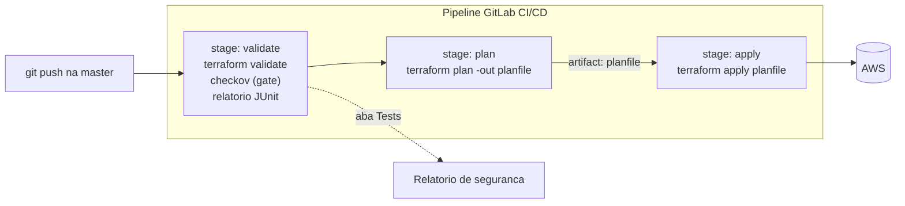

# 03.2 - Validando e gerando relatórios no pipeline

> **Terça-feira, 9h. No dia seguinte ao primeiro pipeline.**
> **Diego Tavares** passa na sua mesa com o café na mão:
>
> > *— "O pipeline de ontem ficou ótimo, parabéns. Mas tem um buraco: ele aplica qualquer coisa. Se alguém abrir um security group `0.0.0.0/0` na porta 22, o pipeline aplica feliz da vida e a gente só descobre quando aparece no scan de segurança da semana seguinte. Eu quero **barrar config insegura ANTES do apply**. E quero ver um **relatório** de cada execução, não ter que ler log linha por linha."*
>
> Você lembra do **Checkov** — scanner de IaC que checa centenas de regras de segurança e gera relatório. É exatamente o gate que falta. Vamos adicioná-lo como um novo stage.

Os comandos de terminal rodam no **Codespaces**. A leitura do pipeline e do relatório acontece no **console do GitLab**.

> [!WARNING]
> **Pré-requisitos obrigatórios antes de começar:**
>
> - [ ] **Lab 03.1 concluído** — você já tem um `.gitlab-ci.yml` funcional com os stages `plan` e `apply` no `primeiro-projeto`, e o pipeline rodou verde.
> - [ ] **GitLab Runner online** com a tag `shell` (módulo 02).
> - [ ] **Checkov instalado no runner** dentro de um virtualenv em `/home/ubuntu/venv` (provisionado via Ansible no módulo 02).
> - [ ] **Chave SSH do GitLab** carregada no Codespaces.
>
> **Valide rapidamente** que você está no projeto certo:
>
> ```bash
> cd /workspaces/FIAP-Platform-Engineering/02-Ansible/01-provisionando-gitlab-runner/primeiro-projeto && cat .gitlab-ci.yml
> ```
>
> Se o `.gitlab-ci.yml` do lab anterior aparecer, você está pronto.

Neste laboratório vamos evoluir o pipeline do lab 03.1. Adicionamos um stage `validate` **antes** do `plan`, que roda duas verificações: `terraform validate` (sintaxe do HCL) e **Checkov** (padrões de segurança e operação comuns no mercado). Ao final, o Checkov gera um **relatório JUnit XML** que o GitLab exibe numa aba dedicada de **Tests** — transformando "config insegura" num gate objetivo e visível.

## Principais pontos de aprendizagem

- adicionar um stage de validação **antes** do `plan` no pipeline
- usar `terraform validate` para checar a sintaxe do HCL
- rodar o **Checkov** como gate de segurança de IaC
- gerar e exportar um relatório no formato **JUnit XML**
- visualizar o relatório na aba **Tests** do GitLab

## O que você terá ao final

Um pipeline de 3 stages (`validate → plan → apply`) onde o `validate` roda o gate de segurança e publica um relatório de testes legível no GitLab. **Diego vai querer abrir a aba Tests e ver o resumo dos checks de segurança de cada execução** — esse é o entregável simbólico do lab.

> [!TIP]
> Sempre que encontrar um bloco com o título **💡 Clique para entender**, abra esse trecho. Ele traz a anatomia do comando, o contexto da aula e links oficiais.

## Mapa do lab

| Parte | O que você faz | Passos | Tempo |
|-------|----------------|--------|-------|
| [Parte 1](#parte-1---abrindo-o-pipeline-existente) | Abrindo o pipeline existente | [1](#passo-1) · [2](#passo-2) | ~5 min |
| [Parte 2](#parte-2---adicionando-o-stage-validate) | Adicionando o stage `validate` | [3](#passo-3) | ~10 min |
| [Parte 3](#parte-3---disparando-o-pipeline) | Disparando o pipeline | [4](#passo-4) · [5](#passo-5) | ~5 min |
| [Parte 4](#parte-4---lendo-o-relatorio-de-testes) | Lendo o relatório de testes | [6](#passo-6) · [7](#passo-7) · [8](#passo-8) | ~10 min |

> [!TIP]
> Se travou em algum passo, clique no número do passo na coluna **Passos** acima.

<details>
<summary><b>💡 O que é o Checkov em uma frase</b></summary>
<blockquote>

[Checkov](https://www.checkov.io/) é um scanner de **Infrastructure as Code** (Terraform, CloudFormation, Kubernetes, etc.) que avalia seu código contra centenas de **políticas de segurança e conformidade** — por exemplo: "o bucket S3 tem criptografia?", "o security group expõe a porta 22 para `0.0.0.0/0`?", "o log de acesso está ligado?".

Ele roda **estaticamente** (não precisa aplicar nada na nuvem), o que o torna perfeito como gate de pipeline: você descobre o problema **antes** do `apply`. O resultado pode sair em vários formatos; aqui usamos o **JUnit XML**, que o GitLab entende nativamente e renderiza como uma lista de testes.

Documentação oficial:
- [Checkov — documentação](https://www.checkov.io/1.Welcome/What%20is%20Checkov.html)
- [Relatórios de teste JUnit no GitLab](https://docs.gitlab.com/ee/ci/testing/unit_test_reports.html)

</blockquote>
</details>

## Contexto

Por que adicionar um stage de validação em vez de confiar só no `plan`?

| Aspecto | Resposta curta |
|---------|----------------|
| **Problema de negócio** | O pipeline do 03.1 aplica qualquer coisa — config insegura chega à nuvem e só é descoberta depois. |
| **Pergunta que ele responde bem** | "Essa mudança viola alguma boa prática de segurança antes de eu aplicar?" |
| **Pergunta que ele responde mal** | "Esse recurso está seguro em runtime?" (Checkov é estático, não testa o recurso já provisionado). |
| **Quando acontece na vida real** | Toda equipe que sofreu um incidente por config insegura acaba colocando um scanner de IaC como gate obrigatório. |

O fluxo agora tem três stages encadeados — o `validate` é a primeira porta:



---

## Parte 1 - Abrindo o pipeline existente

### Resultado esperado desta parte

Ao final desta etapa, você terá o `.gitlab-ci.yml` do lab 03.1 aberto no editor, pronto para evoluir.

---

<a id="passo-1"></a>

**1.** Continuando no repositório `primeiro-projeto`, entre na pasta do projeto:

```bash
cd /workspaces/FIAP-Platform-Engineering/02-Ansible/01-provisionando-gitlab-runner/primeiro-projeto
```

---

<a id="passo-2"></a>

**2.** Abra o `.gitlab-ci.yml` para alterar o conteúdo do pipeline:

```bash
code .gitlab-ci.yml
```

### Checkpoint

Se você chegou até aqui, então:

- você está na pasta do `primeiro-projeto`
- o `.gitlab-ci.yml` do lab anterior está aberto no editor

---

## Parte 2 - Adicionando o stage validate

### Resultado esperado desta parte

Ao final desta etapa, o `.gitlab-ci.yml` terá três stages — `validate`, `plan` e `apply` — com o Checkov rodando no primeiro.

---

<a id="passo-3"></a>

**3.** Atualize o conteúdo do arquivo para ficar como o exemplo abaixo. Foi adicionado o stage `validate`, que roda tanto o `terraform validate` (verifica a sintaxe do Terraform) quanto o [Checkov](https://www.checkov.io/) (verifica padrões de segurança e operação comuns no mercado). Ao final, ele gera e exporta um relatório no formato **JUnit XML**:

```yaml
---
stages:
  - validate
  - plan
  - apply

validate:
  stage: validate
  script:
    - terraform init
    - terraform validate
    - source /home/ubuntu/venv/bin/activate
    - checkov --directory . --framework terraform -o junitxml > Checkov-Report.xml && checkInfra="passou" || checkInfra="nao passou"
    - echo $checkInfra
    - ls -lha
  tags:
    - shell
  artifacts:
    paths:
      - Checkov-Report.xml
    reports:
      junit: Checkov-Report.xml

plan:
  stage: plan
  script:
    - terraform init
    - terraform plan -out "planfile"
  dependencies:
    - validate
  artifacts:
    paths:
      - planfile
  tags:
    - shell

apply:
  stage: apply
  script:
    - terraform init
    - terraform apply planfile
  dependencies:
    - plan
  tags:
    - shell
```

<details>
<summary><b>💡 Clique para entender: anatomia do stage validate</b></summary>
<blockquote>

O job `validate` faz três coisas, em ordem:

- **`terraform validate`**: checa que o HCL é sintaticamente válido e internamente consistente (referências, tipos). É rápido e não toca na nuvem.
- **`source /home/ubuntu/venv/bin/activate`**: ativa o virtualenv Python onde o Checkov foi instalado pelo Ansible (módulo 02). Sem ativar o venv, o comando `checkov` não está no PATH.
- **`checkov --directory . --framework terraform -o junitxml > Checkov-Report.xml`**: roda o scanner sobre o diretório atual, restringindo ao framework `terraform`, e redireciona a saída JUnit XML para um arquivo.

### O truque do `&& ... || ...`

```bash
checkov ... > Checkov-Report.xml && checkInfra="passou" || checkInfra="nao passou"
```

Se o Checkov terminar com sucesso (sem findings que ele considere falha), a variável vira `"passou"`; se ele retornar código de erro, vira `"nao passou"`. O `|| ...` também **evita que o job aborte** quando o Checkov encontra problemas — assim o relatório ainda é gerado e exportado. O `echo $checkInfra` e o `ls -lha` ajudam a inspecionar o resultado no log.

### Bloco de artifacts/reports

- **`artifacts: paths: [Checkov-Report.xml]`**: guarda o XML como arquivo baixável.
- **`reports: junit: Checkov-Report.xml`**: diz ao GitLab para **interpretar** esse XML como um relatório de testes e exibi-lo na aba **Tests** do pipeline. É isso que transforma o log cru numa visão amigável.

### Por que o validate vem antes do plan

Porque é o gate. Falhar cedo (sintaxe + segurança) economiza o tempo do `plan`/`apply` e impede que config insegura avance no pipeline.

Documentação oficial:
- [`terraform validate`](https://developer.hashicorp.com/terraform/cli/commands/validate)
- [Checkov — saída JUnit XML](https://www.checkov.io/2.Basics/Reviewing%20Scan%20Results.html)
- [`artifacts:reports:junit`](https://docs.gitlab.com/ee/ci/yaml/artifacts_reports.html#artifactsreportsjunit)

</blockquote>
</details>

<details>
<summary><b>⚠ Se der erro: <code>checkov: command not found</code> no log do stage validate</b></summary>
<blockquote>

O virtualenv com o Checkov não foi ativado, ou o caminho `/home/ubuntu/venv` não existe no runner:

- Confirme que o módulo 02 (Ansible) terminou de provisionar o runner com o Checkov dentro do venv em `/home/ubuntu/venv`.
- Se o seu venv ficou em outro caminho, ajuste a linha `source /home/ubuntu/venv/bin/activate` para o caminho correto.
- Você pode validar manualmente conectando no EC2 do runner e rodando `source /home/ubuntu/venv/bin/activate && checkov --version`.

</blockquote>
</details>

<details>
<summary><b>⚠ Se der erro: o pipeline fica vermelho no stage validate por causa de findings do Checkov</b></summary>
<blockquote>

O Checkov, por padrão, **retorna código de erro quando encontra findings**, o que pode marcar o stage como falho. Neste lab, o truque `|| checkInfra="nao passou"` no `script` evita o aborto e mantém o relatório sendo gerado.

Se mesmo assim o stage ficar vermelho, é porque o redirecionamento ou o `||` foi alterado. Confira que a linha do `checkov` está **exatamente** como no passo 3 — o `> Checkov-Report.xml && ... || ...` na mesma linha é o que segura o código de saída.

Em pipelines reais você decidiria a política: **barrar o pipeline** quando houver finding crítico (deixando o Checkov falhar de propósito) ou apenas **reportar** (como fazemos aqui, para fins didáticos). Discuta com o Diego qual faz sentido para a Vortex.

</blockquote>
</details>

### Checkpoint

Se você chegou até aqui, então:

- o `.gitlab-ci.yml` tem três stages: `validate`, `plan`, `apply`
- o stage `validate` roda `terraform validate` + Checkov e exporta `Checkov-Report.xml` como relatório JUnit

---

## Parte 3 - Disparando o pipeline

### Resultado esperado desta parte

Ao final desta etapa, o `push` na `master` terá disparado o pipeline com os 3 stages.

---

<a id="passo-4"></a>

**4.** Atualize o repositório do GitLab com os comandos abaixo:

```shell
git add .gitlab-ci.yml
git commit -m "pipeline com validacao"
eval $(ssh-agent -s)
ssh-add -k /home/vscode/.ssh/gitlab
git push origin master
```

<details>
<summary><b>⚠ Se der erro: <code>git@gitlab.com: Permission denied (publickey)</code></b></summary>
<blockquote>

A chave SSH não está carregada na sessão atual. Rode novamente os dois comandos do `ssh-agent`/`ssh-add` acima antes do `git push`.

</blockquote>
</details>

---

<a id="passo-5"></a>

**5.** Vá até os **Pipelines** do seu repositório e note que agora são **3 stages**, em vez de 2:


### Checkpoint

Se você chegou até aqui, então:

- o `push` foi aceito
- o pipeline mais recente mostra três stages (`validate`, `plan`, `apply`)

---

## Parte 4 - Lendo o relatório de testes

### Resultado esperado desta parte

Ao final desta etapa, você terá lido o relatório de segurança gerado pelo Checkov na aba **Tests** do pipeline.

---

<a id="passo-6"></a>

**6.** Aguarde o pipeline terminar e clique na aba **Tests**:


---

<a id="passo-7"></a>

**7.** Nessa tela, o GitLab mostra um resumo dos testes executados por essa execução do pipeline. Clique em **validate** para detalhar:


---

<a id="passo-8"></a>

**8.** Esses foram os testes aplicados ao repositório, baseados nos recursos descritos na configuração do Terraform. Cada linha corresponde a uma política do Checkov avaliada contra o seu código:


> [!TIP]
> Repare que o relatório aponta **quais** checks passaram e falharam. Esse é o material que você levaria para uma revisão de segurança — concreto, por recurso, e gerado automaticamente a cada push.

### Checkpoint

Se você chegou até aqui, então:

- o pipeline rodou os 3 stages
- a aba **Tests** mostra o resumo dos checks do Checkov
- você consegue detalhar os checks clicando em **validate**

---

## Conclusão

Neste laboratório você:

- adicionou um stage `validate` **antes** do `plan` no pipeline
- rodou `terraform validate` (sintaxe) e **Checkov** (gate de segurança de IaC)
- gerou e exportou um relatório em **JUnit XML**
- visualizou o relatório de segurança na aba **Tests** do GitLab

**Mensagem para Diego**: agora a config passa por um scanner de segurança antes do `apply`, e cada execução deixa um relatório legível. Config insegura é flagrada no pipeline, não na fatura. O pedido do começo do mês está completo: push → valida → planeja → aplica, tudo automático e auditável.

---

## Próximo passo

Abra o próximo lab: **[Lab 03.3 — Exercício de CI/CD](../03-Exercicio/README.md)**.

Lá você monta tudo do zero, sozinho: pega o código da demo Count, cria um repositório novo, configura estado remoto e constrói o pipeline de 3 stages — provando que sabe entregar o fluxo completo de CI/CD de infraestrutura.

---

<details>
<summary><b>💡 Glossário rápido — termos que aparecem neste lab</b></summary>
<blockquote>

| Termo | O que é |
|-------|---------|
| **Checkov** | Scanner estático de Infrastructure as Code que avalia o código contra políticas de segurança e conformidade. |
| **`terraform validate`** | Comando que checa a sintaxe e a consistência interna do HCL, sem tocar na nuvem. |
| **Gate de segurança** | Etapa do pipeline que precisa passar antes que a mudança avance — aqui, o stage `validate`. |
| **JUnit XML** | Formato padrão de relatório de testes que o GitLab interpreta e renderiza na aba **Tests**. |
| **`artifacts:reports:junit`** | Chave do `.gitlab-ci.yml` que diz ao GitLab para exibir um XML como relatório de testes. |
| **virtualenv (`venv`)** | Ambiente Python isolado; aqui hospeda o Checkov no runner (`/home/ubuntu/venv`). |
| **Análise estática** | Avaliar o código sem executá-lo/aplicá-lo — o oposto de testar o recurso já provisionado. |

</blockquote>
</details>

<details>
<summary><b>💡 Como pedir ajuda se travou</b></summary>
<blockquote>

Antes de abrir issue, colete estas 4 informações — elas reduzem o tempo de resposta em 10×:

1. **Em que passo você está** (ex: "passo 3, no stage `validate`")
2. **Mensagem de erro literal** (copie o texto do log do GitLab — texto, não screenshot)
3. **O log do stage `validate`** (especialmente as linhas do `checkov` e do `ls -lha`)
4. **O que você já tentou**

Canais (em ordem de prioridade):

- **Issues do repositório**: [github.com/vamperst/FIAP-Platform-Engineering/issues](https://github.com/vamperst/FIAP-Platform-Engineering/issues)
- **E-mail do professor**: `Rafael@rfbarbosa.com`
- **LinkedIn**: [rafael-barbosa-serverless](https://www.linkedin.com/in/rafael-barbosa-serverless/)
- **Antes de tudo**: a maioria dos erros do `validate` é o venv do Checkov não estar ativo. Confira o caminho `/home/ubuntu/venv` no runner.

</blockquote>
</details>
