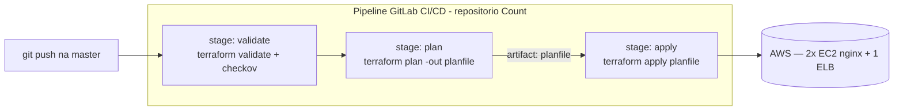

# 03.3 - Exercício: pipeline completo de CI/CD para a frota Count

> **Quinta-feira, 14h. Fim do Mês 3 na Vortex Mobility.**
> O pipeline do `primeiro-projeto` impressionou. **Diego Tavares** te chama para o desafio final do mês:
>
> > *— "Você provou o conceito numa fila SQS. Agora quero ver de pé num caso de verdade: a **frota de servidores web** atrás de um load balancer — aquele código `count` do módulo 01. Monta um repositório novo, coloca estado remoto, e me entrega um pipeline de **3 stages** que valida, planeja e sobe as EC2. No fim quero o pipeline verde, as máquinas no ar e o relatório de segurança visível. Sozinho desta vez — quero saber se você consegue reproduzir o fluxo sem eu olhar por cima."*
>
> Este é o seu "exame prático" do módulo: pegar tudo o que viu em 03.1 e 03.2 e entregar do zero, num código mais realista que uma fila.

Os comandos rodam no **Codespaces**; a configuração de repositório e a leitura do pipeline, no **console do GitLab**; a validação das máquinas, no **console da AWS**.

> [!WARNING]
> **Pré-requisitos obrigatórios antes de começar:**
>
> - [ ] **Labs 03.1 e 03.2 concluídos** — você sabe escrever um `.gitlab-ci.yml` de 3 stages com Checkov e relatório JUnit.
> - [ ] **GitLab Runner online** com a tag `shell` e **Checkov** no venv (`/home/ubuntu/venv`).
> - [ ] **Chave SSH do GitLab** carregada no Codespaces (`/home/vscode/.ssh/gitlab`).
> - [ ] **Credenciais AWS do Academy atualizadas** e a VPC `fiap-lab` existente (a demo Count depende dela).
>
> **Valide rapidamente:**
>
> ```bash
> aws sts get-caller-identity
> ```
>
> **Tempo estimado: 60–90 min** (montar o repositório novo, escrever o pipeline e esperar o `apply` das EC2 + tempo para você ler, ajustar e validar).

Neste exercício você consolida o módulo inteiro **sem passo a passo guiado de código** — a estrutura você já viu nos labs anteriores. O objetivo é pegar o código da **demo Count** (módulo 01), versioná-lo num repositório novo do GitLab, configurar estado remoto e construir um pipeline de 3 stages que valida, planeja e aplica a frota de EC2 atrás de um ELB.

## Principais pontos de aprendizagem

- transpor o pipeline do `primeiro-projeto` para um código novo (a demo Count)
- configurar estado remoto do Terraform num repositório do zero
- montar um pipeline de 3 stages (`validate → plan → apply`) por conta própria
- ler o relatório do Checkov sobre uma infra mais rica (EC2 + ELB + security group)
- registrar a decisão técnica num mini-ADR e limpar a infra paga ao final

## O que você terá ao final

Um repositório novo no GitLab com a demo Count versionada, estado remoto no S3 e um pipeline de 3 stages funcionando: as **EC2 da frota no ar atrás do ELB** e o **relatório de segurança do Checkov visível na aba Tests**. **Diego vai querer ver o pipeline verde, as instâncias `nginx-*` rodando e o relatório — mais o seu mini-ADR justificando as escolhas.**

> [!TIP]
> Este é um exercício, não uma demo guiada. Os comandos de Terraform/GitLab você já viu em 03.1 e 03.2 — aqui o desafio é **você** decidir a ordem e montar o `.gitlab-ci.yml`. Use os labs anteriores como referência.

## Mapa do lab

| Parte | O que você faz | Passos | Tempo |
|-------|----------------|--------|-------|
| [Parte 1](#parte-1---preparando-o-codigo-count) | Preparando o código Count | [1](#passo-1) · [2](#passo-2) | ~10 min |
| [Parte 2](#parte-2---repositorio-novo-e-estado-remoto) | Repositório novo + estado remoto | [3](#passo-3) · [4](#passo-4) · [5](#passo-5) | ~15 min |
| [Parte 3](#parte-3---montando-o-pipeline-de-3-stages) | Montando o pipeline de 3 stages | [6](#passo-6) · [7](#passo-7) | ~15 min |
| [Parte 4](#parte-4---validando-o-entregavel) | Validando o entregável | [8](#passo-8) · [9](#passo-9) · [10](#passo-10) | ~15 min |
| [Parte 5](#parte-5---decisao-e-limpeza) | Decisão (mini-ADR) e limpeza | [11](#passo-11) · [12](#passo-12) | ~15 min |

> [!TIP]
> Se travou em algum passo, clique no número do passo na coluna **Passos** acima.

## Contexto

Por que repetir o pipeline num código diferente em vez de só reusar o `primeiro-projeto`?

| Aspecto | Resposta curta |
|---------|----------------|
| **Problema de negócio** | A Vortex tem muitos repositórios de infra; o pipeline precisa funcionar em qualquer um, não só na fila SQS. |
| **Pergunta que ele responde bem** | "Sei reproduzir o fluxo CI/CD num projeto novo, com infra mais rica (EC2 + ELB)?" |
| **Pergunta que ele responde mal** | "Como gerencio dezenas de pipelines com configuração compartilhada?" (templates de CI — assunto avançado, fora do escopo). |
| **Quando acontece na vida real** | Sempre que um time padroniza CI/CD: o segundo projeto é o teste de que o padrão é replicável. |

O alvo é o mesmo pipeline de 3 stages do lab 03.2, agora sobre a demo Count:



---

## Parte 1 - Preparando o código Count

### Resultado esperado desta parte

Ao final desta etapa, você terá uma cópia do código da demo Count num diretório de trabalho, fora do repositório do curso.

---

<a id="passo-1"></a>

**1.** No Codespaces, copie o código da demo Count (módulo 01) para uma pasta de trabalho separada — você vai versioná-la num repositório próprio:

```bash
mkdir -p /workspaces/FIAP-Platform-Engineering/03-CICD/_entrega-count && cp -r /workspaces/FIAP-Platform-Engineering/01-Terraform/demos/03-Count/* /workspaces/FIAP-Platform-Engineering/03-CICD/_entrega-count/
```

> [!NOTE]
> O `_entrega-count` é só uma área de trabalho local para você montar o repositório. Não modifique o HCL original da demo em `01-Terraform/demos/03-Count/`.

---

<a id="passo-2"></a>

**2.** Confirme o que foi copiado (deve incluir `main.tf`, `variables.tf`, `outputs.tf`, `securitygroup.tf`, `script.sh`):

```bash
ls -la /workspaces/FIAP-Platform-Engineering/03-CICD/_entrega-count
```

### Checkpoint

Se você chegou até aqui, então:

- a pasta `_entrega-count` existe com os arquivos da demo Count
- você não alterou o código original da demo

---

## Parte 2 - Repositório novo e estado remoto

### Resultado esperado desta parte

Ao final desta etapa, o código Count estará num **novo repositório do GitLab**, com **estado remoto no S3** configurado.

---

<a id="passo-3"></a>

**3.** No GitLab, crie um **novo repositório** (ex: `exercicio-cicd-count`). Use a referência do módulo 02 se precisar relembrar como criar o projeto e conectar via SSH.

---

<a id="passo-4"></a>

**4.** Adicione o **estado remoto** do Terraform ao código Count. Crie um arquivo `state.tf` na pasta `_entrega-count` apontando para o seu bucket de estado (`base-config-<SEU-RM>`), com uma `key` distinta da usada no `primeiro-projeto` para não colidir os estados. Use o `state.tf` do `primeiro-projeto` como modelo.

> [!IMPORTANT]
> A `key` do backend precisa ser **única por projeto**. Se você reusar a mesma `key` do `primeiro-projeto`, os dois projetos vão disputar o mesmo arquivo de estado e corromper um ao outro.

---

<a id="passo-5"></a>

**5.** Suba **somente o código da demo Count** (com o `state.tf`) para o novo repositório:

```shell
cd /workspaces/FIAP-Platform-Engineering/03-CICD/_entrega-count
git init && git remote add origin <URL-SSH-DO-SEU-REPO>
git add .
git commit -m "codigo count + estado remoto"
eval $(ssh-agent -s)
ssh-add -k /home/vscode/.ssh/gitlab
git branch -M master
git push -u origin master
```

<details>
<summary><b>⚠ Se der erro: <code>git@gitlab.com: Permission denied (publickey)</code></b></summary>
<blockquote>

A chave SSH não está carregada na sessão atual. Rode novamente os dois comandos `ssh-agent`/`ssh-add` e refaça o `push`.

</blockquote>
</details>

### Checkpoint

Se você chegou até aqui, então:

- o repositório novo existe no GitLab com o código Count
- existe um `state.tf` com backend S3 e `key` única
- o `push` na `master` foi aceito

---

## Parte 3 - Montando o pipeline de 3 stages

### Resultado esperado desta parte

Ao final desta etapa, o repositório terá um `.gitlab-ci.yml` de 3 stages (`validate → plan → apply`) e o pipeline terá disparado.

---

<a id="passo-6"></a>

**6.** Crie o `.gitlab-ci.yml` na raiz do repositório Count com os **3 stages**: `validate` (`terraform validate` + Checkov gerando relatório JUnit), `plan` (com `planfile` como artefato) e `apply` (consumindo o `planfile`). Use o pipeline do **lab 03.2** como referência — a estrutura é a mesma.

> [!TIP]
> Os jobs precisam usar `tags: shell` (o seu runner) e o stage `validate` precisa ativar o venv do Checkov (`source /home/ubuntu/venv/bin/activate`) antes de chamar `checkov`.

---

<a id="passo-7"></a>

**7.** Faça o commit e o `push` do `.gitlab-ci.yml` para disparar o pipeline:

```shell
git add .gitlab-ci.yml
git commit -m "pipeline de 3 stages para a demo count"
eval $(ssh-agent -s)
ssh-add -k /home/vscode/.ssh/gitlab
git push origin master
```

<details>
<summary><b>⚠ Se der erro: o <code>apply</code> falha porque o <code>planfile</code> não chegou ao stage</b></summary>
<blockquote>

O `apply` reclama que `planfile` não existe. Isso acontece quando o artefato não foi passado entre stages:

- O job `plan` precisa declarar `artifacts: paths: [planfile]`.
- O job `apply` precisa declarar `dependencies: [plan]` (e o `plan`, `dependencies: [validate]`).
- Confira que o nome do arquivo é exatamente `planfile` nos dois jobs (`-out "planfile"` no plan e `apply planfile` no apply).

</blockquote>
</details>

<details>
<summary><b>⚠ Se der erro: job <code>stuck</code> / não inicia</b></summary>
<blockquote>

Tag errada ou runner offline. Confirme o runner **online** em **Settings → CI/CD → Runners** e que os jobs usam `tags: shell` (mesma tag do runner). Veja o troubleshoot detalhado no [lab 03.1](../01-Primeiro-pipeline/README.md#parte-2---escrevendo-o-pipeline).

</blockquote>
</details>

### Checkpoint

Se você chegou até aqui, então:

- o `.gitlab-ci.yml` de 3 stages está no repositório Count
- o pipeline disparou com `validate`, `plan` e `apply`

---

## Parte 4 - Validando o entregável

### Resultado esperado desta parte

Ao final desta etapa, você terá confirmado os 3 critérios que o Diego pediu: pipeline verde, máquinas no ar e relatório visível.

---

<a id="passo-8"></a>

**8.** No GitLab, confirme que o pipeline rodou os **3 stages** e está verde.

---

<a id="passo-9"></a>

**9.** No [console EC2](https://us-east-1.console.aws.amazon.com/ec2/home?region=us-east-1#Instances:) da AWS, confirme que existem **2 instâncias** `nginx-001` e `nginx-002` em execução, e que o ELB `terraform-example-elb` foi criado.

---

<a id="passo-10"></a>

**10.** Na aba **Tests** do pipeline, confirme que o **relatório do Checkov** está visível, detalhando os checks de segurança aplicados sobre a infra Count (EC2, ELB, security group).

> [!NOTE]
> A demo Count tem mais recursos que a fila SQS — espere ver **mais checks** no relatório (sobre security group aberto, metadados de EC2, etc.). Esse é o ponto: o mesmo gate aplicado a uma infra mais rica revela mais.

### Checkpoint — os 3 critérios do Diego

- [ ] Pipeline com **3 stages** verde no GitLab
- [ ] **2 EC2 `nginx-*`** no ar atrás do **ELB** no console AWS
- [ ] **Relatório do Checkov** visível na aba **Tests**

---

## Parte 5 - Decisão e limpeza

### Resultado esperado desta parte

Ao final desta etapa, você terá registrado sua decisão técnica num mini-ADR e **destruído a infra paga**.

---

<a id="passo-11"></a>

**11.** Escreva um **mini-ADR** (Architecture Decision Record) curto registrando suas escolhas. Crie um arquivo `DECISION.md` no repositório Count com as seções abaixo, preenchidas em 1-3 linhas cada:

```markdown
# Decisão — Pipeline CI/CD para a frota Count (Vortex Mobility)

## Contexto
Por que este pipeline existe e o que ele entrega (push -> validate -> plan -> apply na frota EC2).

## Política do gate Checkov
Escolhi: ( ) barrar o pipeline em finding crítico  ( ) apenas reportar.
Por quê: _______

## Estado remoto
Bucket: base-config-<SEU-RM> | key escolhida: _______ | por que key separada do primeiro-projeto: _______

## Alternativas descartadas
- _______ (por quê)

## Consequências (positivas / pontos de atenção)
- _______

## Perguntas para validar com o stakeholder (Diego)
1. _______
2. _______
```

<details>
<summary><b>💡 Clique para entender: por que escrever um ADR</b></summary>
<blockquote>

Um ADR é um documento curto que registra **uma decisão técnica com contexto, alternativas e consequências**. Em entrevistas técnicas seniores, saber *escrever sobre a decisão* é tão valorizado quanto saber implementá-la — mostra que você pensa em trade-offs, não só em "fazer funcionar".

A decisão mais interessante aqui é a **política do gate**: deixar o Checkov **barrar** o pipeline em finding crítico (mais seguro, mais atrito) ou apenas **reportar** (menos atrito, depende de disciplina do time). Não há resposta única — registre a sua e o porquê.

</blockquote>
</details>

---

<a id="passo-12"></a>

**12.** Com o entregável validado, **destrua a infra paga** para não consumir o orçamento do Learner Lab. Na pasta do código Count, rode:

```bash
cd /workspaces/FIAP-Platform-Engineering/03-CICD/_entrega-count && terraform destroy -auto-approve
```

> [!CAUTION]
> A demo Count cria **2 EC2 `t3.micro` + 1 ELB**, que são **pagos**. Esquecer ligado por 1 dia consome parte relevante do orçamento do Learner Lab. O `terraform destroy -auto-approve` (a flag `-auto-approve` pula a confirmação manual) é **obrigatório** ao terminar.

### Checkpoint

Se você chegou até aqui, então:

- o `DECISION.md` registra suas escolhas técnicas
- a infra paga (EC2 + ELB) foi destruída

---

## Conclusão

Neste exercício você fez, do zero e sozinho:

- copiou e versionou a demo Count num repositório novo do GitLab
- configurou estado remoto no S3 com `key` própria
- montou um pipeline de 3 stages (`validate → plan → apply`)
- provisionou a frota EC2 + ELB automaticamente e leu o relatório de segurança
- registrou a decisão técnica num mini-ADR e limpou a infra paga

**Mensagem para Diego**: o pipeline não era um truque da fila SQS — ele se reproduz num projeto novo, com infra de verdade, em poucos minutos de configuração. A resposta à pergunta-âncora da Vortex ("quanto tempo para recriar a infra de forma confiável e auditável?") agora é: **um push, validado e automatizado**.

---

## Próximo passo

Você fechou o Mês 3 e o fio condutor do repositório. Prossiga para o **[Trabalho Final](../../Trabalho-final/README.md)**, onde Terraform, Ansible e CI/CD se juntam na entrega de ponta a ponta da infraestrutura da Vortex.

---

<details>
<summary><b>💡 Glossário rápido — termos que aparecem neste lab</b></summary>
<blockquote>

| Termo | O que é |
|-------|---------|
| **Demo Count** | Código Terraform do módulo 01 que provisiona N instâncias EC2 (via `count`) atrás de um ELB. |
| **ELB (Classic Load Balancer)** | Balanceador de carga clássico da AWS (`aws_elb`) que distribui tráfego entre as instâncias. |
| **Estado remoto** | Arquivo de estado do Terraform guardado num bucket S3, compartilhável e versionável. |
| **`key` do backend** | Caminho do arquivo de estado dentro do bucket. Precisa ser único por projeto. |
| **ADR** | Architecture Decision Record — documento curto que registra uma decisão técnica e seu porquê. |
| **Política do gate** | Decisão de barrar ou apenas reportar findings do scanner de segurança no pipeline. |

</blockquote>
</details>

<details>
<summary><b>💡 Como pedir ajuda se travou</b></summary>
<blockquote>

Antes de abrir issue, colete estas 4 informações — elas reduzem o tempo de resposta em 10×:

1. **Em que passo você está** (ex: "passo 7, o `apply` falha")
2. **Mensagem de erro literal** (copie o texto do log do GitLab — texto, não screenshot)
3. **O `.gitlab-ci.yml`** que você montou e o `state.tf` (com o nome do bucket/`key`)
4. **O que você já tentou**

Canais (em ordem de prioridade):

- **Issues do repositório**: [github.com/vamperst/FIAP-Platform-Engineering/issues](https://github.com/vamperst/FIAP-Platform-Engineering/issues)
- **E-mail do professor**: `Rafael@rfbarbosa.com`
- **LinkedIn**: [rafael-barbosa-serverless](https://www.linkedin.com/in/rafael-barbosa-serverless/)
- **Antes de tudo**: a maioria dos erros aqui é `planfile` não passando entre stages (faltou `dependencies`/`artifacts`) ou `key` de estado colidindo com o `primeiro-projeto`.

</blockquote>
</details>
