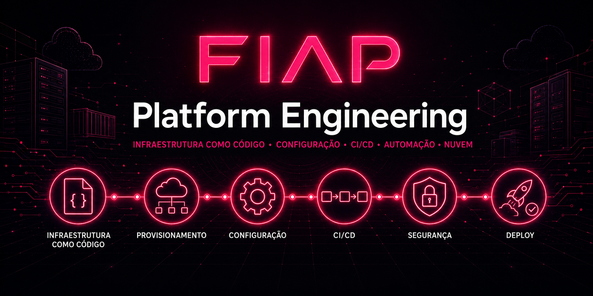
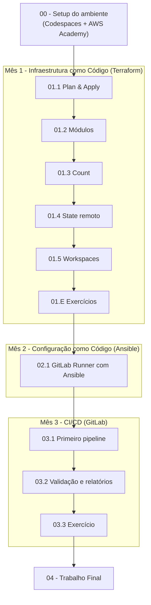

<p align="center">
  
</p>

# Platform Engineering

Repositório oficial dos laboratórios práticos da disciplina **Platform Engineering** do MBA da FIAP. Aqui você encontrará todas as demos guiadas, exercícios, código Terraform/Ansible e pipelines de CI/CD para evoluir de uma infraestrutura criada "na mão no console" até uma plataforma reproduzível, automatizada e validada na nuvem AWS.

---

## Visão geral

Os laboratórios foram desenhados para serem executados em um ambiente padronizado (GitHub Codespaces + AWS Academy), garantindo que todos os alunos tenham a mesma experiência, sem precisar instalar Terraform, Ansible ou AWS CLI localmente.

Para dar sentido a cada demo, acompanhamos uma empresa fictícia ao longo de todo o curso: a **Vortex Mobility**, uma startup brasileira de micromobilidade urbana (e-scooters e e-bikes) com sede em São Paulo, em hipercrescimento, escalando de 3 para 30 cidades. A infraestrutura da Vortex foi toda criada clicando no console da AWS — e isso parou de escalar: ninguém consegue reproduzir ambientes, os deploys são manuais e arriscados.

Você foi contratado(a) como **Platform Engineer**. Quem te passa as demandas é **Helena Marques** (Head de Engenharia de Plataforma), e seu mentor no dia a dia é **Diego Tavares** (SRE sênior). A pergunta que guia o curso inteiro é simples e desconfortável:

> *"Quanto tempo a Vortex leva para recriar toda a sua infraestrutura do zero, de forma confiável e auditável?"*

No início, a resposta é *"dias, na mão, e ninguém tem certeza"*. Ao final, será *"um push, automatizado e validado"*. O caminho até lá tem três meses:

1. **Mês 1 — Infraestrutura como Código (Terraform):** provisionar, componentizar (módulos), escalar (`count`), colaborar sem corromper estado (state remoto no S3) e isolar ambientes (workspaces).
2. **Mês 2 — Configuração como Código (Ansible):** automatizar a configuração de um GitLab Runner próprio de forma repetível.
3. **Mês 3 — CI/CD (GitLab):** fazer todo push na master rodar `plan` e `apply` sozinho, com um gate de segurança que barra configuração insegura antes de chegar na nuvem.

---

## Pré-requisitos

Antes de iniciar qualquer laboratório, você precisa de:

- uma conta no [GitHub](https://github.com) (para fork do repositório e Codespaces)
- uma conta ativa no [AWS Academy](https://www.awsacademy.com/LMS_Login) com a turma `AWS Academy Learner Lab`
- acesso ao email institucional da FIAP (`rm<SEU RM>@fiap.com.br`)

> [!IMPORTANT]
> **SEMPRE DESLIGUE** o Codespaces ao final da aula para não consumir créditos desnecessariamente. Acesse [github.com/codespaces](https://github.com/codespaces), clique nos três pontinhos ao lado do ambiente e selecione `Stop Codespace`.

---

## Como usar este repositório

### 1. Faça o fork

Clique em `Fork` no canto superior direito da página do repositório no GitHub e copie-o para sua conta. Mantenha a opção `Copy the master branch only` **desmarcada** para ter acesso a todas as branches.

### 2. Crie o Codespaces

A partir do seu fork, crie um Codespace usando a configuração `FIAP Lab` na região `US East` com máquina `2-core`. O ambiente já vem com todas as dependências necessárias (AWS CLI, Terraform, Ansible via Python, Node, Docker-in-Docker e scripts de apoio).

### 3. Configure as credenciais AWS

A cada sessão do AWS Academy, copie as credenciais em `AWS Details → AWS CLI` para o arquivo `~/.aws/credentials` do Codespaces. Valide com:

```bash
aws sts get-caller-identity
```

Se retornar o JSON com seu `Account` e `Arn`, você está pronto.

### 4. Siga os laboratórios na ordem

Comece pelo setup e avance sequencialmente. Cada laboratório tem seu próprio `README.md` com instruções passo a passo, explicações contextuais (blocos `💡 Clique para entender`) e prints de referência.

> [!TIP]
> O passo a passo completo de configuração está em [00-create-codespaces/README.md](00-create-codespaces/README.md), e o ritual de início de cada aula está em [00-create-codespaces/Inicio-de-aula.md](00-create-codespaces/Inicio-de-aula.md). Guarde esse material — você vai reutilizá-lo em toda aula ao atualizar as credenciais.

---

## Demos disponíveis

| # | Laboratório | Descrição | Link |
|---|-------------|-----------|------|
| 00 | **Setup e configuração do ambiente** | Fork do repositório, criação do Codespaces, acesso à conta AWS Academy, criação do bucket base no S3, configuração de credenciais e chave SSH. Inclui o ritual de início de cada aula. | [00-create-codespaces](00-create-codespaces/README.md) |
| 01.1 | **Terraform — Plan & Apply** | Primeiro contato com o fluxo Terraform na Vortex: escrever um recurso, rodar `plan`, `apply` e `destroy`, entendendo o ciclo de vida da infraestrutura como código. | [01-Terraform/demos/01-Plan-Apply](01-Terraform/demos/01-Plan-Apply) |
| 01.2 | **Terraform — Módulos** | Componentizar a rede da Vortex (VPC, subnets, gateways) em módulos reutilizáveis, em vez de repetir blocos de recurso. | [01-Terraform/demos/02-Modules](01-Terraform/demos/02-Modules) |
| 01.3 | **Terraform — Count** | Escalar a frota de servidores da Vortex com `count`, provisionando N instâncias idênticas a partir de uma única definição. | [01-Terraform/demos/03-Count](01-Terraform/demos/03-Count) |
| 01.4 | **Terraform — State remoto** | Colaborar em time sem corromper o estado: mover o state para um backend remoto no S3, com lock e versionamento. | [01-Terraform/demos/04-State](01-Terraform/demos/04-State) |
| 01.5 | **Terraform — Workspaces** | Isolar `dev` e `prod` a partir do mesmo código usando workspaces, sem duplicar configuração. | [01-Terraform/demos/05-Workspaces](01-Terraform/demos/05-Workspaces) |
| 01.E | **Exercícios — Terraform** | Exercícios práticos de `count` e de `state`/`workspaces` para fixar os conceitos do módulo. | [01-Terraform/exercicios](01-Terraform/exercicios) |
| 02.1 | **Ansible — Provisionando o GitLab Runner** | Usar Ansible para configurar de forma repetível um servidor que hospeda um GitLab Runner próprio da Vortex, em vez de configurar máquina por máquina na mão. | [02-Ansible/01-provisionando-gitlab-runner](02-Ansible/01-provisionando-gitlab-runner/README.md) |
| 03.1 | **CI/CD — Primeiro pipeline** | Montar o primeiro pipeline GitLab CI/CD da Vortex: todo push na master dispara `plan` e `apply` automaticamente, usando o runner provisionado no módulo anterior. | [03-CICD/01-Primeiro-pipeline](03-CICD/01-Primeiro-pipeline) |
| 03.2 | **CI/CD — Validação e relatórios** | Adicionar um gate de segurança ao pipeline que valida a configuração e gera relatórios, barrando infraestrutura insegura antes de chegar na nuvem. | [03-CICD/02-Validando-e-gerando-relatorios](03-CICD/02-Validando-e-gerando-relatorios) |
| 03.3 | **CI/CD — Exercício** | Exercício final do módulo de CI/CD, consolidando pipeline, runner e gate de segurança. | [03-CICD/03-Exercicio](03-CICD/03-Exercicio) |
| 04 | **Trabalho Final** | Projeto end-to-end que consolida IaC, configuração e CI/CD da plataforma da Vortex, com entregável pronto para upload no portal FIAP. | [Trabalho-final](Trabalho-final/README.md) |

---

## Estrutura do repositório

```
.
├── 00-create-codespaces/                      # Setup do ambiente (Codespaces, AWS Academy, credenciais, SSH)
├── 01-Terraform/
│   ├── demos/
│   │   ├── 01-Plan-Apply/                      # Demo 01.1 — fluxo plan/apply/destroy
│   │   ├── 02-Modules/                         # Demo 01.2 — módulos de rede (VPC)
│   │   ├── 03-Count/                           # Demo 01.3 — escalar a frota com count
│   │   ├── 04-State/                           # Demo 01.4 — state remoto no S3
│   │   └── 05-Workspaces/                      # Demo 01.5 — isolar dev/prod com workspaces
│   └── exercicios/
│       ├── count/                              # Exercício de count
│       └── State-e-workspace/                  # Exercício de state e workspaces
├── 02-Ansible/
│   └── 01-provisionando-gitlab-runner/         # Lab 02.1 — Ansible configurando o GitLab Runner
├── 03-CICD/
│   ├── 01-Primeiro-pipeline/                   # Lab 03.1 — primeiro pipeline GitLab CI/CD
│   ├── 02-Validando-e-gerando-relatorios/      # Lab 03.2 — gate de segurança + relatórios
│   └── 03-Exercicio/                           # Lab 03.3 — exercício final de CI/CD
├── Trabalho-final/                             # Projeto final consolidando IaC + config + CI/CD
├── .devcontainer/                              # Configuração do GitHub Codespaces
└── FIAP.png
```

---

## Fluxo recomendado

O arco da Vortex é cronológico: cada mês depende do anterior. Você não consegue automatizar deploys (Mês 3) sem ter um runner configurado (Mês 2), e não configura o runner sem saber provisionar infraestrutura como código (Mês 1).



Cada laboratório assume que os anteriores foram concluídos. Em especial:

- Os labs de **Terraform (01.x)** introduzem os conceitos em ordem de dificuldade: o state remoto (01.4) e os workspaces (01.5) só fazem sentido depois de você ter provisionado e componentizado infraestrutura (01.1 a 01.3).
- O lab de **Ansible (02.1)** provisiona o GitLab Runner que será usado pelos pipelines do Mês 3 — sem ele, o módulo de CI/CD não tem onde rodar.
- Os labs de **CI/CD (03.x)** dependem do runner do Mês 2 e do código Terraform do Mês 1: o pipeline automatiza exatamente o `plan`/`apply` que você aprendeu a rodar na mão no primeiro mês.

---

## Dicas gerais

- **Blocos `💡 Clique para entender`**: sempre que encontrar nos READMEs, abra — eles trazem o contexto técnico e a motivação pedagógica de cada comando.
- **`cd` absoluto nos comandos**: os blocos de terminal usam caminhos como `/workspaces/FIAP-Platform-Engineering/...` para que cada passo seja autossuficiente, mesmo se você reabrir o terminal.
- **Credenciais expiradas?** Cada sessão do AWS Academy dura 4 horas. Basta iniciar uma nova sessão e recopiar as credenciais para `~/.aws/credentials` (ritual descrito em [Inicio-de-aula.md](00-create-codespaces/Inicio-de-aula.md)).
- **Infraestrutura paga rodando?** Ao final de cada aula que cria recursos (EC2, etc.), rode `terraform destroy -auto-approve` dentro da pasta do lab para zerar os recursos e proteger o orçamento do Learner Lab.

---

## Suporte

Caso encontre algum problema:

1. Releia atentamente o passo em que você está — os READMEs trazem os erros mais comuns sinalizados com `> [!IMPORTANT]`, `> [!WARNING]` ou blocos `⚠ Se der erro`.
2. Valide os pré-requisitos listados no início de cada laboratório.
3. Consulte o professor ou monitores durante a aula.

### Contato

Ficou com alguma dúvida ou quer trocar uma ideia sobre os laboratórios?

- 🐛 **Issues:** [github.com/vamperst/FIAP-Platform-Engineering/issues](https://github.com/vamperst/FIAP-Platform-Engineering/issues)
- 📧 **Email:** [Rafael@rfbarbosa.com](mailto:Rafael@rfbarbosa.com)
- 💼 **LinkedIn:** [Rafael Barbosa](https://www.linkedin.com/in/rafael-barbosa-serverless/)

---

**Bons estudos!** 🎓
